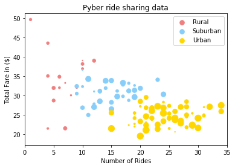
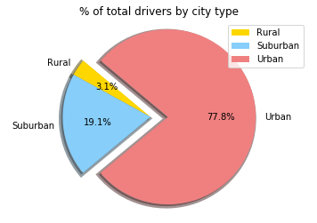
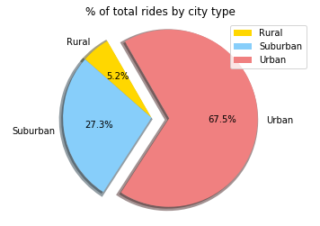
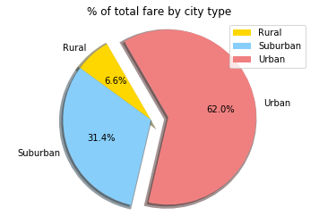

# Pyber Ride Sharing Data
## Analysis
#### 1. From bubble plot we could see that rides in rural cities have earned higher fare, but number of rides are more in urban cities
#### 2. Total number of drivers and rides are higher in Urban cities compared to other cities.
#### 3. As number of rides and drivers are high in Urban, total fare collected is higher in urban compared to others.


```python
import csv
import matplotlib.pyplot as plt
import pandas as pd
import numpy as np
```


```python
city_df=pd.read_csv("city_data.csv")
ride_df=pd.read_csv("ride_data.csv")
merge_df=pd.merge(city_df,ride_df,on="city")
merge_df.head()
```


<div>
<style>
    .dataframe thead tr:only-child th {
        text-align: right;
    }

    .dataframe thead th {
        text-align: left;
    }

    .dataframe tbody tr th {
        vertical-align: top;
    }
</style>
<table border="1" class="dataframe">
  <thead>
    <tr style="text-align: right;">
      <th></th>
      <th>city</th>
      <th>driver_count</th>
      <th>type</th>
      <th>date</th>
      <th>fare</th>
      <th>ride_id</th>
    </tr>
  </thead>
  <tbody>
    <tr>
      <th>0</th>
      <td>Kelseyland</td>
      <td>63</td>
      <td>Urban</td>
      <td>2016-08-19 04:27:52</td>
      <td>5.51</td>
      <td>6246006544795</td>
    </tr>
    <tr>
      <th>1</th>
      <td>Kelseyland</td>
      <td>63</td>
      <td>Urban</td>
      <td>2016-04-17 06:59:50</td>
      <td>5.54</td>
      <td>7466473222333</td>
    </tr>
    <tr>
      <th>2</th>
      <td>Kelseyland</td>
      <td>63</td>
      <td>Urban</td>
      <td>2016-05-04 15:06:07</td>
      <td>30.54</td>
      <td>2140501382736</td>
    </tr>
    <tr>
      <th>3</th>
      <td>Kelseyland</td>
      <td>63</td>
      <td>Urban</td>
      <td>2016-01-25 20:44:56</td>
      <td>12.08</td>
      <td>1896987891309</td>
    </tr>
    <tr>
      <th>4</th>
      <td>Kelseyland</td>
      <td>63</td>
      <td>Urban</td>
      <td>2016-08-09 18:19:47</td>
      <td>17.91</td>
      <td>8784212854829</td>
    </tr>
  </tbody>
</table>
</div>


# Relationship between four key variables


```python
driver_count = merge_df.groupby('city')['driver_count'].agg(lambda series: series.mode())
city_type = merge_df.groupby('city')['type'].agg(lambda series: series.mode())

fares = merge_df.groupby('city').mean()['fare']
counts = merge_df['city'].value_counts()

final_report=pd.DataFrame({"Type of City":city_type,
              "Total Number of Drivers": driver_count,
               "Total Number of Rides Per City":counts,
              "Fare ($) Per City": fares})

final_report1=pd.DataFrame({"Type of City":city_type,
              "Total Number of Drivers": driver_count,
               "Total Number of Rides Per City":counts,
              "Fare Per City": fares})


final_report=final_report.round(2)
final_report["Fare ($) Per City"]=final_report["Fare ($) Per City"].map("${:,.2f}".format)
final_report.head()
```


<div>
<style>
    .dataframe thead tr:only-child th {
        text-align: right;
    }

    .dataframe thead th {
        text-align: left;
    }

    .dataframe tbody tr th {
        vertical-align: top;
    }
</style>
<table border="1" class="dataframe">
  <thead>
    <tr style="text-align: right;">
      <th></th>
      <th>Fare ($) Per City</th>
      <th>Total Number of Drivers</th>
      <th>Total Number of Rides Per City</th>
      <th>Type of City</th>
    </tr>
  </thead>
  <tbody>
    <tr>
      <th>Alvarezhaven</th>
      <td>$23.93</td>
      <td>21</td>
      <td>31</td>
      <td>Urban</td>
    </tr>
    <tr>
      <th>Alyssaberg</th>
      <td>$20.61</td>
      <td>67</td>
      <td>26</td>
      <td>Urban</td>
    </tr>
    <tr>
      <th>Anitamouth</th>
      <td>$37.32</td>
      <td>16</td>
      <td>9</td>
      <td>Suburban</td>
    </tr>
    <tr>
      <th>Antoniomouth</th>
      <td>$23.62</td>
      <td>21</td>
      <td>22</td>
      <td>Urban</td>
    </tr>
    <tr>
      <th>Aprilchester</th>
      <td>$21.98</td>
      <td>49</td>
      <td>19</td>
      <td>Urban</td>
    </tr>
  </tbody>
</table>
</div>


# Bubble plot of ride sharing data


```python
final_report1['Total Number of Rides Per City']
final_report1['Fare Per City']
labels=city_df['type']

df_scatter = pd.DataFrame(dict(number_of_rides=final_report1['Total Number of Rides Per City'], fare=final_report1['Fare Per City'],
                               type_of_city=final_report1['Type of City'],total_driver=final_report1['Total Number of Drivers']))
```


```python
df_scatter.head()
fig, ax = plt.subplots()
colors = {'Urban':'gold', 'Suburban':'lightskyblue', 'Rural':'lightcoral'}
ax.scatter(df_scatter['number_of_rides'], df_scatter['fare'], 
           c=df_scatter['type_of_city'].apply(lambda x: colors[x]),marker='o')
```


```python
fig, ax = plt.subplots()

colors = {'Urban':'gold', 'Suburban':'lightskyblue', 'Rural':'lightcoral'}
s = [n*2 for n in range(int(max(merge_df['fare'])))]
grouped = df_scatter.groupby('type_of_city')
for key, group in grouped:
    group.plot(ax=ax, kind='scatter', x='number_of_rides', y='fare', label=key, color=colors[key],marker='o',s=s)
plt.xlim(0,35)
plt.title("Pyber ride sharing data")
plt.xlabel("Number of Rides")
plt.ylabel("Total Fare in ($)")
plt.show()
```





```python
total_rides_bytype=merge_df.groupby("type").count()["ride_id"]
total_fare_bytype= merge_df.groupby("type").sum()["fare"]
total_drivers_bytype=city_df.groupby("type").sum()["driver_count"]

total_fare=ride_df["fare"].sum()
total_rides=ride_df["ride_id"].count()
total_drivers=city_df["driver_count"].sum()

percentage_rides=total_rides_bytype/total_rides * 100
percentage_rides=percentage_rides.round(2)

percentage_fare=total_fare_bytype/total_fare * 100
percentage_fare=percentage_fare.round(2)

percentage_drivers=total_drivers_bytype/total_drivers * 100
percentage_drivers=percentage_drivers.round(2)

pie_frame=pd.DataFrame({"Total Rides": total_rides_bytype,
                       "Total Drivers":total_drivers_bytype,
                       "Total Fare": total_fare_bytype},dtype=object)

pie_frame=pie_frame.reset_index()
# pie_frame["Total Fare"]=pie_frame["Total Fare"].map("${:,.2f}".format)
pie_frame
```


<div>
<style>
    .dataframe thead tr:only-child th {
        text-align: right;
    }

    .dataframe thead th {
        text-align: left;
    }

    .dataframe tbody tr th {
        vertical-align: top;
    }
</style>
<table border="1" class="dataframe">
  <thead>
    <tr style="text-align: right;">
      <th></th>
      <th>type</th>
      <th>Total Drivers</th>
      <th>Total Fare</th>
      <th>Total Rides</th>
    </tr>
  </thead>
  <tbody>
    <tr>
      <th>0</th>
      <td>Rural</td>
      <td>104</td>
      <td>4255.09</td>
      <td>125</td>
    </tr>
    <tr>
      <th>1</th>
      <td>Suburban</td>
      <td>638</td>
      <td>20335.7</td>
      <td>657</td>
    </tr>
    <tr>
      <th>2</th>
      <td>Urban</td>
      <td>2607</td>
      <td>40078.3</td>
      <td>1625</td>
    </tr>
  </tbody>
</table>
</div>


```python
city_type=list(pie_frame["type"])
drivers=list(pie_frame["Total Drivers"])
rides=list(pie_frame["Total Rides"])
fare=list(pie_frame["Total Fare"])
explode=[0, 0, .2]
```

# Total drivers by city type


```python
plt.pie(drivers,labels=city_type,explode=explode,autopct='%1.1f%%', colors=['gold', 'lightskyblue', 'lightcoral'],wedgeprops={'linewidth': 5}, shadow = True, startangle=140)
plt.title("% of total drivers by city type")
plt.legend()
plt.axis('equal')
plt.show()
```





# Total rides by city type


```python
plt.pie(rides,labels=city_type,explode=explode,autopct='%1.1f%%', colors=['gold', 'lightskyblue', 'lightcoral'],
        wedgeprops={'linewidth': 5}, shadow = True, startangle=120)
plt.title("% of total rides by city type")
plt.axis('equal')
plt.legend()
plt.show()
```





# Total fare by city type


```python
plt.pie(fare,labels=city_type,explode=explode,autopct='%1.1f%%',  colors=['gold', 'lightskyblue', 'lightcoral'],wedgeprops={'linewidth': 5}, shadow = True, startangle=120)
plt.title("% of total fare by city type")
plt.axis('equal')
plt.legend()
plt.show()
```




