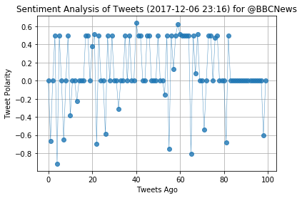
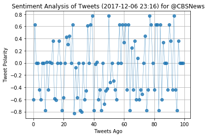
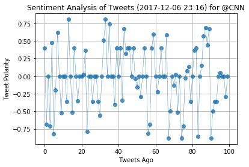
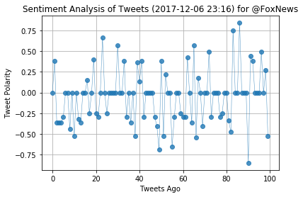
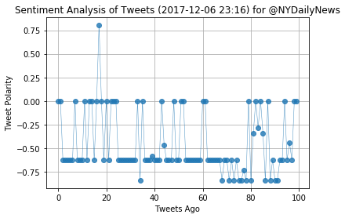
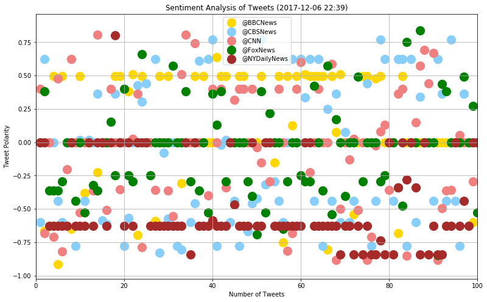
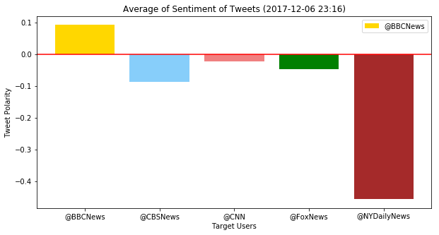

# News Mood

### 1. From the execution of script from time to time we could see that polarity of tweets changes a lot.
### 2. From last execution we understand that NYDailyNews has more negative tweets.
### 3. BBC news is the only target user which has postive polarity of tweets.


```python
# Dependencies
import numpy as np
import pandas as pd
import matplotlib.pyplot as plt
import json
import tweepy
from datetime import datetime
from config import consumer_key,consumer_secret,access_token,access_token_secret
from vaderSentiment.vaderSentiment import SentimentIntensityAnalyzer
analyzer = SentimentIntensityAnalyzer()
import matplotlib.colors as plt_colors
```

# Setup Tweepy API Authentication


```python

auth = tweepy.OAuthHandler(consumer_key, consumer_secret)
auth.set_access_token(access_token, access_token_secret)
api = tweepy.API(auth, parser=tweepy.parsers.JSONParser())
```

# Target Account and required list


```python

target_users=["@BBCNews", "@CBSNews", "@CNN", "@FoxNews", "@NYDailyNews"]
compound_list = []
target_user=[]
positive_list = []
negative_list = []
neutral_list = []
tweet_id_list = []
user_id_list = []
date_list =[]
```

# Loop to gether tweets for target users


```python
for target in target_users:
    public_tweets = api.search(target, lang="en",count=100)
#     print(len(public_tweets["statuses"][0]["text"]))
#     print(public_tweets["statuses"][0]["text"])
        # print(public_tweets)
    #     print(json.dumps(public_tweets, indent=4, sort_keys=True))
    for tweet in public_tweets["statuses"]:
#         print(tweet["id_str"])
        # Run Vader Analysis on each tweet
        results = analyzer.polarity_scores(tweet["text"])
        compound = results["compound"]
        pos = results["pos"]
        neu = results["neu"]
        neg = results["neg"]

        # Add each value to the appropriate list
        compound_list.append(compound)
        positive_list.append(pos)
        negative_list.append(neg)
        neutral_list.append(neu)
        date_list.append(tweet["created_at"])
        tweet_id_list.append(tweet["id_str"])
        user_id_list.append(tweet["user"]["id"])
        target_user.append(target)


```

# DataFrame of tweet polarity


```python
data_df=pd.DataFrame({"Target":target_user,
                      "Tweet ID":tweet_id_list,
                      "Date": date_list,
                      "User ID": user_id_list,
                      "Postivie": positive_list,
                     "Negative": negative_list,
                     "Neutal": neutral_list,
                     "Compound":compound_list})

data_df=data_df[["Target","Tweet ID","Date","User ID","Postivie","Negative","Neutal","Compound"]]
data_df.head()
```


<div>
<style>
    .dataframe thead tr:only-child th {
        text-align: right;
    }

    .dataframe thead th {
        text-align: left;
    }

    .dataframe tbody tr th {
        vertical-align: top;
    }
</style>
<table border="1" class="dataframe">
  <thead>
    <tr style="text-align: right;">
      <th></th>
      <th>Target</th>
      <th>Tweet ID</th>
      <th>Date</th>
      <th>User ID</th>
      <th>Postivie</th>
      <th>Negative</th>
      <th>Neutal</th>
      <th>Compound</th>
    </tr>
  </thead>
  <tbody>
    <tr>
      <th>0</th>
      <td>@BBCNews</td>
      <td>938628716955095046</td>
      <td>Thu Dec 07 04:38:19 +0000 2017</td>
      <td>100845723</td>
      <td>0.000</td>
      <td>0.000</td>
      <td>1.000</td>
      <td>0.0000</td>
    </tr>
    <tr>
      <th>1</th>
      <td>@BBCNews</td>
      <td>938628681869742080</td>
      <td>Thu Dec 07 04:38:11 +0000 2017</td>
      <td>1272182414</td>
      <td>0.134</td>
      <td>0.293</td>
      <td>0.573</td>
      <td>-0.6633</td>
    </tr>
    <tr>
      <th>2</th>
      <td>@BBCNews</td>
      <td>938628583903305729</td>
      <td>Thu Dec 07 04:37:47 +0000 2017</td>
      <td>19426419</td>
      <td>0.000</td>
      <td>0.000</td>
      <td>1.000</td>
      <td>0.0000</td>
    </tr>
    <tr>
      <th>3</th>
      <td>@BBCNews</td>
      <td>938628369104736256</td>
      <td>Thu Dec 07 04:36:56 +0000 2017</td>
      <td>242100367</td>
      <td>0.412</td>
      <td>0.000</td>
      <td>0.588</td>
      <td>0.4939</td>
    </tr>
    <tr>
      <th>4</th>
      <td>@BBCNews</td>
      <td>938628346518343681</td>
      <td>Thu Dec 07 04:36:51 +0000 2017</td>
      <td>4905998279</td>
      <td>0.000</td>
      <td>0.498</td>
      <td>0.502</td>
      <td>-0.9169</td>
    </tr>
  </tbody>
</table>
</div>


# Create scatter plot of tweet polartiy for each target


```python
for target in target_users:
#     plt.figure(figsize=(10,8))
    target_df = data_df[data_df["Target"] == target]
    plt.plot(np.arange(len(target_df["Compound"])),
         target_df["Compound"], marker="o", linewidth=0.5,
         alpha=0.8,aa=True)

    # # Incorporate the other graph properties
    now = datetime.now()
    now = now.strftime("%Y-%m-%d %H:%M")
    plt.title("Sentiment Analysis of Tweets ({}) for {}".format(now, target))
    plt.ylabel("Tweet Polarity")
    plt.xlabel("Tweets Ago")
    plt.grid()
    plt.show()
```

















```python
templist=[]
for i in range(0,5):
    for x in range(1,101):
        templist.append(x)

data_df['Tweet ID by Target']=templist
```

# Sentiment Analysis of tweet polarity


```python
fig, ax = plt.subplots(figsize=(13, 8))

colors =  {'@BBCNews':'gold', '@CBSNews':'lightskyblue', '@CNN':'lightcoral','@FoxNews':'green','@NYDailyNews':'brown'}

grouped = data_df.groupby('Target')
for key, group in grouped:
    group.plot(ax=ax, kind='scatter',x='Tweet ID by Target' , y='Compound', label=key, color=colors[key],marker='o',s=200)

plt.xlim(0,100)

plt.title("Sentiment Analysis of Tweets ({})".format(now))
plt.xlabel("Number of Tweets")
plt.ylabel("Tweet Polarity")
plt.grid()
plt.show()
```





```python
bar_df=pd.DataFrame(grouped['Compound'].mean()).reset_index()
```


```python
colors =  {'@BBCNews':'gold', '@CBSNews':'lightskyblue', '@CNN':'lightcoral','@FoxNews':'green','@NYDailyNews':'brown'}

plt.figure(figsize=(10,5))
plt.bar(bar_df.index, bar_df["Compound"], color=[colors[i] for i in bar_df['Target']],
        tick_label=bar_df["Target"])
```


    <Container object of 5 artists>


```python
plt.legend(bar_df['Target'])
plt.axhline(0,color='r')
plt.title("Average of Sentiment of Tweets ({})".format(now))
plt.xlabel("Target Users")
plt.ylabel("Tweet Polarity")
plt.show()
```




