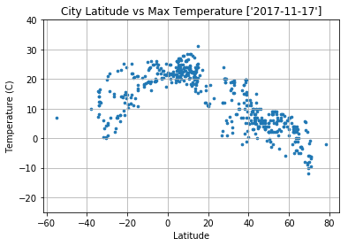
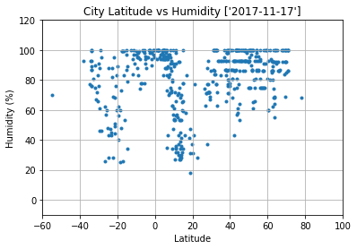
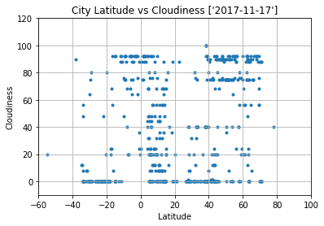
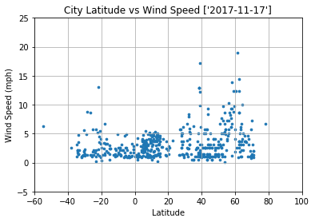

# WeatherPy
### 1. From temperature vs latitude plot we could can understand that temperature is very high at equator and temperature goes down when city is far from equator
### 2. Humidity is high for the cities near by equator and get lower when city away from equator.
### 3. Wind speed and clouds very scattered and hard to predict. We need to further analyze with respect to time of day.


```python
import json
import requests as req
import pandas as pd
from citipy import citipy
import random
import matplotlib.pyplot as plt
import time
from datetime import datetime
```


```python
#API and Query URL
api_key="951c0337f93ba8540fbc8dccec194378"
url = "http://api.openweathermap.org/data/2.5/weather?"
```


```python
#Requried variables to store data
range_long=range(-30,30)
range_lat=range(-180,180)
cities=[]
City_ID=[]
City_Name=[]
Country=[] 
Date=[] 
Max_Temp=[] 
Lat=[] 
Lng=[]
Humidity=[]
Wind_Speed=[]
clouds=[]
len(cities)
```


    0


# Query City and API Call


```python
print("Beginning Data Retrieval")
print("-----------------------------")
num=0
#Logic to select 500 distinct cities and their weather data from Open Weather API
while len(cities)<500:
    lat=random.choice(range_long)
    lng=random.choice(range_lat)
    name=citipy.nearest_city(lng,lat)
    city_name=name.city_name
    if city_name not in cities:
        num=num+1
        print(f"Processing Record for {num} City : {city_name}")
        try:
            query_url = url + "appid=" + api_key + "&q=" + city_name + "&units=metric"
            print(query_url)
            weather_response = req.get(query_url).json()
            City_ID.append(weather_response['id'])
            City_Name.append(weather_response['name'])
            clouds.append(weather_response['clouds'].get('all'))
            Country.append(weather_response['sys'].get('country'))
            Date.append(datetime.fromtimestamp(weather_response['dt']).strftime('%Y-%m-%d'))
            Max_Temp.append(weather_response['main'].get('temp_max'))
            Lat.append(weather_response['coord'].get('lat'))
            Lng.append(weather_response['coord'].get('lon'))
            Humidity.append(weather_response['main'].get('humidity'))
            Wind_Speed.append(weather_response['wind'].get('speed'))
            cities.append(city_name)
        except KeyError:
            pass

```

    Beginning Data Retrieval
    -----------------------------
    Processing Record for 1 City : hermanus
    http://api.openweathermap.org/data/2.5/weather?appid=951c0337f93ba8540fbc8dccec194378&q=hermanus&units=metric
    Processing Record for 2 City : ushuaia
    http://api.openweathermap.org/data/2.5/weather?appid=951c0337f93ba8540fbc8dccec194378&q=ushuaia&units=metric
    Processing Record for 3 City : illoqqortoormiut
    http://api.openweathermap.org/data/2.5/weather?appid=951c0337f93ba8540fbc8dccec194378&q=illoqqortoormiut&units=metric
    Processing Record for 4 City : oranjemund
    http://api.openweathermap.org/data/2.5/weather?appid=951c0337f93ba8540fbc8dccec194378&q=oranjemund&units=metric
    Processing Record for 5 City : barentsburg
    http://api.openweathermap.org/data/2.5/weather?appid=951c0337f93ba8540fbc8dccec194378&q=barentsburg&units=metric
    Processing Record for 6 City : marawi
    http://api.openweathermap.org/data/2.5/weather?appid=951c0337f93ba8540fbc8dccec194378&q=marawi&units=metric
    Processing Record for 7 City : longyearbyen
    http://api.openweathermap.org/data/2.5/weather?appid=951c0337f93ba8540fbc8dccec194378&q=longyearbyen&units=metric
    Processing Record for 8 City : ponta do sol
    http://api.openweathermap.org/data/2.5/weather?appid=951c0337f93ba8540fbc8dccec194378&q=ponta do sol&units=metric
    Processing Record for 9 City : vila franca do campo
    http://api.openweathermap.org/data/2.5/weather?appid=951c0337f93ba8540fbc8dccec194378&q=vila franca do campo&units=metric
    Processing Record for 10 City : jamestown
    http://api.openweathermap.org/data/2.5/weather?appid=951c0337f93ba8540fbc8dccec194378&q=jamestown&units=metric
    Processing Record for 11 City : brae
    http://api.openweathermap.org/data/2.5/weather?appid=951c0337f93ba8540fbc8dccec194378&q=brae&units=metric
    Processing Record for 12 City : aflu
    http://api.openweathermap.org/data/2.5/weather?appid=951c0337f93ba8540fbc8dccec194378&q=aflu&units=metric
    Processing Record for 13 City : sao filipe
    http://api.openweathermap.org/data/2.5/weather?appid=951c0337f93ba8540fbc8dccec194378&q=sao filipe&units=metric
    Processing Record for 14 City : bredasdorp
    http://api.openweathermap.org/data/2.5/weather?appid=951c0337f93ba8540fbc8dccec194378&q=bredasdorp&units=metric
    Processing Record for 15 City : peceneaga
    http://api.openweathermap.org/data/2.5/weather?appid=951c0337f93ba8540fbc8dccec194378&q=peceneaga&units=metric
    Processing Record for 16 City : cervo
    http://api.openweathermap.org/data/2.5/weather?appid=951c0337f93ba8540fbc8dccec194378&q=cervo&units=metric
    Processing Record for 17 City : sorland
    http://api.openweathermap.org/data/2.5/weather?appid=951c0337f93ba8540fbc8dccec194378&q=sorland&units=metric
    Processing Record for 18 City : sirvintos
    http://api.openweathermap.org/data/2.5/weather?appid=951c0337f93ba8540fbc8dccec194378&q=sirvintos&units=metric
    Processing Record for 19 City : stamsund
    http://api.openweathermap.org/data/2.5/weather?appid=951c0337f93ba8540fbc8dccec194378&q=stamsund&units=metric
    Processing Record for 20 City : warqla
    http://api.openweathermap.org/data/2.5/weather?appid=951c0337f93ba8540fbc8dccec194378&q=warqla&units=metric
    Processing Record for 21 City : cidreira
    http://api.openweathermap.org/data/2.5/weather?appid=951c0337f93ba8540fbc8dccec194378&q=cidreira&units=metric
    Processing Record for 22 City : georgetown
    http://api.openweathermap.org/data/2.5/weather?appid=951c0337f93ba8540fbc8dccec194378&q=georgetown&units=metric
    Processing Record for 23 City : luderitz
    http://api.openweathermap.org/data/2.5/weather?appid=951c0337f93ba8540fbc8dccec194378&q=luderitz&units=metric
    Processing Record for 24 City : mehamn
    http://api.openweathermap.org/data/2.5/weather?appid=951c0337f93ba8540fbc8dccec194378&q=mehamn&units=metric
    Processing Record for 25 City : vadso
    http://api.openweathermap.org/data/2.5/weather?appid=951c0337f93ba8540fbc8dccec194378&q=vadso&units=metric
    Processing Record for 26 City : asfi
    http://api.openweathermap.org/data/2.5/weather?appid=951c0337f93ba8540fbc8dccec194378&q=asfi&units=metric
    Processing Record for 27 City : abnub
    http://api.openweathermap.org/data/2.5/weather?appid=951c0337f93ba8540fbc8dccec194378&q=abnub&units=metric
    Processing Record for 28 City : straumen
    http://api.openweathermap.org/data/2.5/weather?appid=951c0337f93ba8540fbc8dccec194378&q=straumen&units=metric
    Processing Record for 29 City : hofn
    http://api.openweathermap.org/data/2.5/weather?appid=951c0337f93ba8540fbc8dccec194378&q=hofn&units=metric
    Processing Record for 30 City : adrar
    http://api.openweathermap.org/data/2.5/weather?appid=951c0337f93ba8540fbc8dccec194378&q=adrar&units=metric
    Processing Record for 31 City : tessalit
    http://api.openweathermap.org/data/2.5/weather?appid=951c0337f93ba8540fbc8dccec194378&q=tessalit&units=metric
    Processing Record for 32 City : port-gentil
    http://api.openweathermap.org/data/2.5/weather?appid=951c0337f93ba8540fbc8dccec194378&q=port-gentil&units=metric
    Processing Record for 33 City : staden
    http://api.openweathermap.org/data/2.5/weather?appid=951c0337f93ba8540fbc8dccec194378&q=staden&units=metric
    Processing Record for 34 City : grindavik
    http://api.openweathermap.org/data/2.5/weather?appid=951c0337f93ba8540fbc8dccec194378&q=grindavik&units=metric
    Processing Record for 35 City : oussouye
    http://api.openweathermap.org/data/2.5/weather?appid=951c0337f93ba8540fbc8dccec194378&q=oussouye&units=metric
    Processing Record for 36 City : nouadhibou
    http://api.openweathermap.org/data/2.5/weather?appid=951c0337f93ba8540fbc8dccec194378&q=nouadhibou&units=metric
    Processing Record for 37 City : ghanzi
    http://api.openweathermap.org/data/2.5/weather?appid=951c0337f93ba8540fbc8dccec194378&q=ghanzi&units=metric
    Processing Record for 38 City : opole lubelskie
    http://api.openweathermap.org/data/2.5/weather?appid=951c0337f93ba8540fbc8dccec194378&q=opole lubelskie&units=metric
    Processing Record for 39 City : bridlington
    http://api.openweathermap.org/data/2.5/weather?appid=951c0337f93ba8540fbc8dccec194378&q=bridlington&units=metric
    Processing Record for 40 City : kembe
    http://api.openweathermap.org/data/2.5/weather?appid=951c0337f93ba8540fbc8dccec194378&q=kembe&units=metric
    Processing Record for 41 City : mar del plata
    http://api.openweathermap.org/data/2.5/weather?appid=951c0337f93ba8540fbc8dccec194378&q=mar del plata&units=metric
    Processing Record for 42 City : menongue
    http://api.openweathermap.org/data/2.5/weather?appid=951c0337f93ba8540fbc8dccec194378&q=menongue&units=metric
    Processing Record for 43 City : lebyazhye
    http://api.openweathermap.org/data/2.5/weather?appid=951c0337f93ba8540fbc8dccec194378&q=lebyazhye&units=metric
    Processing Record for 44 City : tuggurt
    http://api.openweathermap.org/data/2.5/weather?appid=951c0337f93ba8540fbc8dccec194378&q=tuggurt&units=metric
    Processing Record for 45 City : bubaque
    http://api.openweathermap.org/data/2.5/weather?appid=951c0337f93ba8540fbc8dccec194378&q=bubaque&units=metric
    Processing Record for 46 City : beterou
    http://api.openweathermap.org/data/2.5/weather?appid=951c0337f93ba8540fbc8dccec194378&q=beterou&units=metric
    Processing Record for 47 City : cape coast
    http://api.openweathermap.org/data/2.5/weather?appid=951c0337f93ba8540fbc8dccec194378&q=cape coast&units=metric
    Processing Record for 48 City : cabinda
    http://api.openweathermap.org/data/2.5/weather?appid=951c0337f93ba8540fbc8dccec194378&q=cabinda&units=metric
    Processing Record for 49 City : agadez
    http://api.openweathermap.org/data/2.5/weather?appid=951c0337f93ba8540fbc8dccec194378&q=agadez&units=metric
    Processing Record for 50 City : arraial do cabo
    http://api.openweathermap.org/data/2.5/weather?appid=951c0337f93ba8540fbc8dccec194378&q=arraial do cabo&units=metric
    Processing Record for 51 City : olafsvik
    http://api.openweathermap.org/data/2.5/weather?appid=951c0337f93ba8540fbc8dccec194378&q=olafsvik&units=metric
    Processing Record for 52 City : mao
    http://api.openweathermap.org/data/2.5/weather?appid=951c0337f93ba8540fbc8dccec194378&q=mao&units=metric
    Processing Record for 53 City : cape town
    http://api.openweathermap.org/data/2.5/weather?appid=951c0337f93ba8540fbc8dccec194378&q=cape town&units=metric
    Processing Record for 54 City : kruisfontein
    http://api.openweathermap.org/data/2.5/weather?appid=951c0337f93ba8540fbc8dccec194378&q=kruisfontein&units=metric
    Processing Record for 55 City : port elizabeth
    http://api.openweathermap.org/data/2.5/weather?appid=951c0337f93ba8540fbc8dccec194378&q=port elizabeth&units=metric
    Processing Record for 56 City : agucadoura
    http://api.openweathermap.org/data/2.5/weather?appid=951c0337f93ba8540fbc8dccec194378&q=agucadoura&units=metric
    Processing Record for 57 City : los llanos de aridane
    http://api.openweathermap.org/data/2.5/weather?appid=951c0337f93ba8540fbc8dccec194378&q=los llanos de aridane&units=metric
    Processing Record for 58 City : kalomo
    http://api.openweathermap.org/data/2.5/weather?appid=951c0337f93ba8540fbc8dccec194378&q=kalomo&units=metric
    Processing Record for 59 City : ifo
    http://api.openweathermap.org/data/2.5/weather?appid=951c0337f93ba8540fbc8dccec194378&q=ifo&units=metric
    Processing Record for 60 City : henties bay
    http://api.openweathermap.org/data/2.5/weather?appid=951c0337f93ba8540fbc8dccec194378&q=henties bay&units=metric
    Processing Record for 61 City : cutro
    http://api.openweathermap.org/data/2.5/weather?appid=951c0337f93ba8540fbc8dccec194378&q=cutro&units=metric
    Processing Record for 62 City : ribeira grande
    http://api.openweathermap.org/data/2.5/weather?appid=951c0337f93ba8540fbc8dccec194378&q=ribeira grande&units=metric
    Processing Record for 63 City : kananga
    http://api.openweathermap.org/data/2.5/weather?appid=951c0337f93ba8540fbc8dccec194378&q=kananga&units=metric
    Processing Record for 64 City : jalu
    http://api.openweathermap.org/data/2.5/weather?appid=951c0337f93ba8540fbc8dccec194378&q=jalu&units=metric
    Processing Record for 65 City : natitingou
    http://api.openweathermap.org/data/2.5/weather?appid=951c0337f93ba8540fbc8dccec194378&q=natitingou&units=metric
    Processing Record for 66 City : kangaba
    http://api.openweathermap.org/data/2.5/weather?appid=951c0337f93ba8540fbc8dccec194378&q=kangaba&units=metric
    Processing Record for 67 City : tonneins
    http://api.openweathermap.org/data/2.5/weather?appid=951c0337f93ba8540fbc8dccec194378&q=tonneins&units=metric
    Processing Record for 68 City : golspie
    http://api.openweathermap.org/data/2.5/weather?appid=951c0337f93ba8540fbc8dccec194378&q=golspie&units=metric
    Processing Record for 69 City : wittlich
    http://api.openweathermap.org/data/2.5/weather?appid=951c0337f93ba8540fbc8dccec194378&q=wittlich&units=metric
    Processing Record for 70 City : varkaus
    http://api.openweathermap.org/data/2.5/weather?appid=951c0337f93ba8540fbc8dccec194378&q=varkaus&units=metric
    Processing Record for 71 City : saldanha
    http://api.openweathermap.org/data/2.5/weather?appid=951c0337f93ba8540fbc8dccec194378&q=saldanha&units=metric
    Processing Record for 72 City : klaksvik
    http://api.openweathermap.org/data/2.5/weather?appid=951c0337f93ba8540fbc8dccec194378&q=klaksvik&units=metric
    Processing Record for 73 City : namibe
    http://api.openweathermap.org/data/2.5/weather?appid=951c0337f93ba8540fbc8dccec194378&q=namibe&units=metric
    Processing Record for 74 City : sinazongwe
    http://api.openweathermap.org/data/2.5/weather?appid=951c0337f93ba8540fbc8dccec194378&q=sinazongwe&units=metric
    Processing Record for 75 City : monster
    http://api.openweathermap.org/data/2.5/weather?appid=951c0337f93ba8540fbc8dccec194378&q=monster&units=metric
    Processing Record for 76 City : maragogi
    http://api.openweathermap.org/data/2.5/weather?appid=951c0337f93ba8540fbc8dccec194378&q=maragogi&units=metric
    Processing Record for 77 City : loandjili
    http://api.openweathermap.org/data/2.5/weather?appid=951c0337f93ba8540fbc8dccec194378&q=loandjili&units=metric
    Processing Record for 78 City : adre
    http://api.openweathermap.org/data/2.5/weather?appid=951c0337f93ba8540fbc8dccec194378&q=adre&units=metric
    Processing Record for 79 City : faya
    http://api.openweathermap.org/data/2.5/weather?appid=951c0337f93ba8540fbc8dccec194378&q=faya&units=metric
    Processing Record for 80 City : ponta delgada
    http://api.openweathermap.org/data/2.5/weather?appid=951c0337f93ba8540fbc8dccec194378&q=ponta delgada&units=metric
    Processing Record for 81 City : vila velha
    http://api.openweathermap.org/data/2.5/weather?appid=951c0337f93ba8540fbc8dccec194378&q=vila velha&units=metric
    Processing Record for 82 City : umm kaddadah
    http://api.openweathermap.org/data/2.5/weather?appid=951c0337f93ba8540fbc8dccec194378&q=umm kaddadah&units=metric
    Processing Record for 83 City : dingle
    http://api.openweathermap.org/data/2.5/weather?appid=951c0337f93ba8540fbc8dccec194378&q=dingle&units=metric
    Processing Record for 84 City : dalvik
    http://api.openweathermap.org/data/2.5/weather?appid=951c0337f93ba8540fbc8dccec194378&q=dalvik&units=metric
    Processing Record for 85 City : takoradi
    http://api.openweathermap.org/data/2.5/weather?appid=951c0337f93ba8540fbc8dccec194378&q=takoradi&units=metric
    Processing Record for 86 City : goderich
    http://api.openweathermap.org/data/2.5/weather?appid=951c0337f93ba8540fbc8dccec194378&q=goderich&units=metric
    Processing Record for 87 City : banyo
    http://api.openweathermap.org/data/2.5/weather?appid=951c0337f93ba8540fbc8dccec194378&q=banyo&units=metric
    Processing Record for 88 City : maghama
    http://api.openweathermap.org/data/2.5/weather?appid=951c0337f93ba8540fbc8dccec194378&q=maghama&units=metric
    Processing Record for 89 City : nalut
    http://api.openweathermap.org/data/2.5/weather?appid=951c0337f93ba8540fbc8dccec194378&q=nalut&units=metric
    Processing Record for 90 City : leua
    http://api.openweathermap.org/data/2.5/weather?appid=951c0337f93ba8540fbc8dccec194378&q=leua&units=metric
    Processing Record for 91 City : maltahohe
    http://api.openweathermap.org/data/2.5/weather?appid=951c0337f93ba8540fbc8dccec194378&q=maltahohe&units=metric
    Processing Record for 92 City : honningsvag
    http://api.openweathermap.org/data/2.5/weather?appid=951c0337f93ba8540fbc8dccec194378&q=honningsvag&units=metric
    Processing Record for 93 City : sorvag
    http://api.openweathermap.org/data/2.5/weather?appid=951c0337f93ba8540fbc8dccec194378&q=sorvag&units=metric
    Processing Record for 94 City : walvis bay
    http://api.openweathermap.org/data/2.5/weather?appid=951c0337f93ba8540fbc8dccec194378&q=walvis bay&units=metric
    Processing Record for 95 City : penzance
    http://api.openweathermap.org/data/2.5/weather?appid=951c0337f93ba8540fbc8dccec194378&q=penzance&units=metric
    Processing Record for 96 City : gat
    http://api.openweathermap.org/data/2.5/weather?appid=951c0337f93ba8540fbc8dccec194378&q=gat&units=metric
    Processing Record for 97 City : lubaczow
    http://api.openweathermap.org/data/2.5/weather?appid=951c0337f93ba8540fbc8dccec194378&q=lubaczow&units=metric
    Processing Record for 98 City : khakhea
    http://api.openweathermap.org/data/2.5/weather?appid=951c0337f93ba8540fbc8dccec194378&q=khakhea&units=metric
    Processing Record for 99 City : nara
    http://api.openweathermap.org/data/2.5/weather?appid=951c0337f93ba8540fbc8dccec194378&q=nara&units=metric
    Processing Record for 100 City : boddam
    http://api.openweathermap.org/data/2.5/weather?appid=951c0337f93ba8540fbc8dccec194378&q=boddam&units=metric
    Processing Record for 101 City : lubao
    http://api.openweathermap.org/data/2.5/weather?appid=951c0337f93ba8540fbc8dccec194378&q=lubao&units=metric
    Processing Record for 102 City : husavik
    http://api.openweathermap.org/data/2.5/weather?appid=951c0337f93ba8540fbc8dccec194378&q=husavik&units=metric
    Processing Record for 103 City : quthing
    http://api.openweathermap.org/data/2.5/weather?appid=951c0337f93ba8540fbc8dccec194378&q=quthing&units=metric
    Processing Record for 104 City : suwalki
    http://api.openweathermap.org/data/2.5/weather?appid=951c0337f93ba8540fbc8dccec194378&q=suwalki&units=metric
    Processing Record for 105 City : zemio
    http://api.openweathermap.org/data/2.5/weather?appid=951c0337f93ba8540fbc8dccec194378&q=zemio&units=metric
    Processing Record for 106 City : vestmannaeyjar
    http://api.openweathermap.org/data/2.5/weather?appid=951c0337f93ba8540fbc8dccec194378&q=vestmannaeyjar&units=metric
    Processing Record for 107 City : lagoa
    http://api.openweathermap.org/data/2.5/weather?appid=951c0337f93ba8540fbc8dccec194378&q=lagoa&units=metric
    Processing Record for 108 City : gberia fotombu
    http://api.openweathermap.org/data/2.5/weather?appid=951c0337f93ba8540fbc8dccec194378&q=gberia fotombu&units=metric
    Processing Record for 109 City : damara
    http://api.openweathermap.org/data/2.5/weather?appid=951c0337f93ba8540fbc8dccec194378&q=damara&units=metric
    Processing Record for 110 City : puerto del rosario
    http://api.openweathermap.org/data/2.5/weather?appid=951c0337f93ba8540fbc8dccec194378&q=puerto del rosario&units=metric
    Processing Record for 111 City : timra
    http://api.openweathermap.org/data/2.5/weather?appid=951c0337f93ba8540fbc8dccec194378&q=timra&units=metric
    Processing Record for 112 City : wolsztyn
    http://api.openweathermap.org/data/2.5/weather?appid=951c0337f93ba8540fbc8dccec194378&q=wolsztyn&units=metric
    Processing Record for 113 City : george
    http://api.openweathermap.org/data/2.5/weather?appid=951c0337f93ba8540fbc8dccec194378&q=george&units=metric
    Processing Record for 114 City : jega
    http://api.openweathermap.org/data/2.5/weather?appid=951c0337f93ba8540fbc8dccec194378&q=jega&units=metric
    Processing Record for 115 City : raudeberg
    http://api.openweathermap.org/data/2.5/weather?appid=951c0337f93ba8540fbc8dccec194378&q=raudeberg&units=metric
    Processing Record for 116 City : tiznit
    http://api.openweathermap.org/data/2.5/weather?appid=951c0337f93ba8540fbc8dccec194378&q=tiznit&units=metric
    Processing Record for 117 City : bilma
    http://api.openweathermap.org/data/2.5/weather?appid=951c0337f93ba8540fbc8dccec194378&q=bilma&units=metric
    Processing Record for 118 City : babanusah
    http://api.openweathermap.org/data/2.5/weather?appid=951c0337f93ba8540fbc8dccec194378&q=babanusah&units=metric
    Processing Record for 119 City : dunkwa
    http://api.openweathermap.org/data/2.5/weather?appid=951c0337f93ba8540fbc8dccec194378&q=dunkwa&units=metric
    Processing Record for 120 City : hell
    http://api.openweathermap.org/data/2.5/weather?appid=951c0337f93ba8540fbc8dccec194378&q=hell&units=metric
    Processing Record for 121 City : olafsvik
    http://api.openweathermap.org/data/2.5/weather?appid=951c0337f93ba8540fbc8dccec194378&q=olafsvik&units=metric
    Processing Record for 122 City : newry
    http://api.openweathermap.org/data/2.5/weather?appid=951c0337f93ba8540fbc8dccec194378&q=newry&units=metric
    Processing Record for 123 City : taoudenni
    http://api.openweathermap.org/data/2.5/weather?appid=951c0337f93ba8540fbc8dccec194378&q=taoudenni&units=metric
    Processing Record for 124 City : koutsouras
    http://api.openweathermap.org/data/2.5/weather?appid=951c0337f93ba8540fbc8dccec194378&q=koutsouras&units=metric
    Processing Record for 125 City : babanusah
    http://api.openweathermap.org/data/2.5/weather?appid=951c0337f93ba8540fbc8dccec194378&q=babanusah&units=metric
    Processing Record for 126 City : wum
    http://api.openweathermap.org/data/2.5/weather?appid=951c0337f93ba8540fbc8dccec194378&q=wum&units=metric
    Processing Record for 127 City : skagastrond
    http://api.openweathermap.org/data/2.5/weather?appid=951c0337f93ba8540fbc8dccec194378&q=skagastrond&units=metric
    Processing Record for 128 City : ostersund
    http://api.openweathermap.org/data/2.5/weather?appid=951c0337f93ba8540fbc8dccec194378&q=ostersund&units=metric
    Processing Record for 129 City : ippy
    http://api.openweathermap.org/data/2.5/weather?appid=951c0337f93ba8540fbc8dccec194378&q=ippy&units=metric
    Processing Record for 130 City : osuna
    http://api.openweathermap.org/data/2.5/weather?appid=951c0337f93ba8540fbc8dccec194378&q=osuna&units=metric
    Processing Record for 131 City : atar
    http://api.openweathermap.org/data/2.5/weather?appid=951c0337f93ba8540fbc8dccec194378&q=atar&units=metric
    Processing Record for 132 City : raudeberg
    http://api.openweathermap.org/data/2.5/weather?appid=951c0337f93ba8540fbc8dccec194378&q=raudeberg&units=metric
    Processing Record for 133 City : warqla
    http://api.openweathermap.org/data/2.5/weather?appid=951c0337f93ba8540fbc8dccec194378&q=warqla&units=metric
    Processing Record for 134 City : kajaani
    http://api.openweathermap.org/data/2.5/weather?appid=951c0337f93ba8540fbc8dccec194378&q=kajaani&units=metric
    Processing Record for 135 City : araouane
    http://api.openweathermap.org/data/2.5/weather?appid=951c0337f93ba8540fbc8dccec194378&q=araouane&units=metric
    Processing Record for 136 City : ornskoldsvik
    http://api.openweathermap.org/data/2.5/weather?appid=951c0337f93ba8540fbc8dccec194378&q=ornskoldsvik&units=metric
    Processing Record for 137 City : ilinge
    http://api.openweathermap.org/data/2.5/weather?appid=951c0337f93ba8540fbc8dccec194378&q=ilinge&units=metric
    Processing Record for 138 City : stornoway
    http://api.openweathermap.org/data/2.5/weather?appid=951c0337f93ba8540fbc8dccec194378&q=stornoway&units=metric
    Processing Record for 139 City : mbandaka
    http://api.openweathermap.org/data/2.5/weather?appid=951c0337f93ba8540fbc8dccec194378&q=mbandaka&units=metric
    Processing Record for 140 City : crotone
    http://api.openweathermap.org/data/2.5/weather?appid=951c0337f93ba8540fbc8dccec194378&q=crotone&units=metric
    Processing Record for 141 City : sistranda
    http://api.openweathermap.org/data/2.5/weather?appid=951c0337f93ba8540fbc8dccec194378&q=sistranda&units=metric
    Processing Record for 142 City : bousso
    http://api.openweathermap.org/data/2.5/weather?appid=951c0337f93ba8540fbc8dccec194378&q=bousso&units=metric
    Processing Record for 143 City : karla
    http://api.openweathermap.org/data/2.5/weather?appid=951c0337f93ba8540fbc8dccec194378&q=karla&units=metric
    Processing Record for 144 City : mwinilunga
    http://api.openweathermap.org/data/2.5/weather?appid=951c0337f93ba8540fbc8dccec194378&q=mwinilunga&units=metric
    Processing Record for 145 City : soubre
    http://api.openweathermap.org/data/2.5/weather?appid=951c0337f93ba8540fbc8dccec194378&q=soubre&units=metric
    Processing Record for 146 City : bonthe
    http://api.openweathermap.org/data/2.5/weather?appid=951c0337f93ba8540fbc8dccec194378&q=bonthe&units=metric
    Processing Record for 147 City : umea
    http://api.openweathermap.org/data/2.5/weather?appid=951c0337f93ba8540fbc8dccec194378&q=umea&units=metric
    Processing Record for 148 City : gagnoa
    http://api.openweathermap.org/data/2.5/weather?appid=951c0337f93ba8540fbc8dccec194378&q=gagnoa&units=metric
    Processing Record for 149 City : praia da vitoria
    http://api.openweathermap.org/data/2.5/weather?appid=951c0337f93ba8540fbc8dccec194378&q=praia da vitoria&units=metric
    Processing Record for 150 City : kikwit
    http://api.openweathermap.org/data/2.5/weather?appid=951c0337f93ba8540fbc8dccec194378&q=kikwit&units=metric
    Processing Record for 151 City : sembe
    http://api.openweathermap.org/data/2.5/weather?appid=951c0337f93ba8540fbc8dccec194378&q=sembe&units=metric
    Processing Record for 152 City : abong mbang
    http://api.openweathermap.org/data/2.5/weather?appid=951c0337f93ba8540fbc8dccec194378&q=abong mbang&units=metric
    Processing Record for 153 City : riorges
    http://api.openweathermap.org/data/2.5/weather?appid=951c0337f93ba8540fbc8dccec194378&q=riorges&units=metric
    Processing Record for 154 City : jabinyanah
    http://api.openweathermap.org/data/2.5/weather?appid=951c0337f93ba8540fbc8dccec194378&q=jabinyanah&units=metric
    Processing Record for 155 City : kjollefjord
    http://api.openweathermap.org/data/2.5/weather?appid=951c0337f93ba8540fbc8dccec194378&q=kjollefjord&units=metric
    Processing Record for 156 City : werda
    http://api.openweathermap.org/data/2.5/weather?appid=951c0337f93ba8540fbc8dccec194378&q=werda&units=metric
    Processing Record for 157 City : lerwick
    http://api.openweathermap.org/data/2.5/weather?appid=951c0337f93ba8540fbc8dccec194378&q=lerwick&units=metric
    Processing Record for 158 City : peniche
    http://api.openweathermap.org/data/2.5/weather?appid=951c0337f93ba8540fbc8dccec194378&q=peniche&units=metric
    Processing Record for 159 City : ulcinj
    http://api.openweathermap.org/data/2.5/weather?appid=951c0337f93ba8540fbc8dccec194378&q=ulcinj&units=metric
    Processing Record for 160 City : sorvag
    http://api.openweathermap.org/data/2.5/weather?appid=951c0337f93ba8540fbc8dccec194378&q=sorvag&units=metric
    Processing Record for 161 City : saint-junien
    http://api.openweathermap.org/data/2.5/weather?appid=951c0337f93ba8540fbc8dccec194378&q=saint-junien&units=metric
    Processing Record for 162 City : olafsvik
    http://api.openweathermap.org/data/2.5/weather?appid=951c0337f93ba8540fbc8dccec194378&q=olafsvik&units=metric
    Processing Record for 163 City : isiro
    http://api.openweathermap.org/data/2.5/weather?appid=951c0337f93ba8540fbc8dccec194378&q=isiro&units=metric
    Processing Record for 164 City : monatele
    http://api.openweathermap.org/data/2.5/weather?appid=951c0337f93ba8540fbc8dccec194378&q=monatele&units=metric
    Processing Record for 165 City : san giorgio del sannio
    http://api.openweathermap.org/data/2.5/weather?appid=951c0337f93ba8540fbc8dccec194378&q=san giorgio del sannio&units=metric
    Processing Record for 166 City : medea
    http://api.openweathermap.org/data/2.5/weather?appid=951c0337f93ba8540fbc8dccec194378&q=medea&units=metric
    Processing Record for 167 City : lixourion
    http://api.openweathermap.org/data/2.5/weather?appid=951c0337f93ba8540fbc8dccec194378&q=lixourion&units=metric
    Processing Record for 168 City : akureyri
    http://api.openweathermap.org/data/2.5/weather?appid=951c0337f93ba8540fbc8dccec194378&q=akureyri&units=metric
    Processing Record for 169 City : kidal
    http://api.openweathermap.org/data/2.5/weather?appid=951c0337f93ba8540fbc8dccec194378&q=kidal&units=metric
    Processing Record for 170 City : arcachon
    http://api.openweathermap.org/data/2.5/weather?appid=951c0337f93ba8540fbc8dccec194378&q=arcachon&units=metric
    Processing Record for 171 City : pala
    http://api.openweathermap.org/data/2.5/weather?appid=951c0337f93ba8540fbc8dccec194378&q=pala&units=metric
    Processing Record for 172 City : hwange
    http://api.openweathermap.org/data/2.5/weather?appid=951c0337f93ba8540fbc8dccec194378&q=hwange&units=metric
    Processing Record for 173 City : kaoma
    http://api.openweathermap.org/data/2.5/weather?appid=951c0337f93ba8540fbc8dccec194378&q=kaoma&units=metric
    Processing Record for 174 City : mazara del vallo
    http://api.openweathermap.org/data/2.5/weather?appid=951c0337f93ba8540fbc8dccec194378&q=mazara del vallo&units=metric
    Processing Record for 175 City : axim
    http://api.openweathermap.org/data/2.5/weather?appid=951c0337f93ba8540fbc8dccec194378&q=axim&units=metric
    Processing Record for 176 City : santa cruz de tenerife
    http://api.openweathermap.org/data/2.5/weather?appid=951c0337f93ba8540fbc8dccec194378&q=santa cruz de tenerife&units=metric
    Processing Record for 177 City : olafsvik
    http://api.openweathermap.org/data/2.5/weather?appid=951c0337f93ba8540fbc8dccec194378&q=olafsvik&units=metric
    Processing Record for 178 City : marsa matruh
    http://api.openweathermap.org/data/2.5/weather?appid=951c0337f93ba8540fbc8dccec194378&q=marsa matruh&units=metric
    Processing Record for 179 City : port alfred
    http://api.openweathermap.org/data/2.5/weather?appid=951c0337f93ba8540fbc8dccec194378&q=port alfred&units=metric
    Processing Record for 180 City : aflu
    http://api.openweathermap.org/data/2.5/weather?appid=951c0337f93ba8540fbc8dccec194378&q=aflu&units=metric
    Processing Record for 181 City : suleja
    http://api.openweathermap.org/data/2.5/weather?appid=951c0337f93ba8540fbc8dccec194378&q=suleja&units=metric
    Processing Record for 182 City : plettenberg bay
    http://api.openweathermap.org/data/2.5/weather?appid=951c0337f93ba8540fbc8dccec194378&q=plettenberg bay&units=metric
    Processing Record for 183 City : birao
    http://api.openweathermap.org/data/2.5/weather?appid=951c0337f93ba8540fbc8dccec194378&q=birao&units=metric
    Processing Record for 184 City : lucapa
    http://api.openweathermap.org/data/2.5/weather?appid=951c0337f93ba8540fbc8dccec194378&q=lucapa&units=metric
    Processing Record for 185 City : findochty
    http://api.openweathermap.org/data/2.5/weather?appid=951c0337f93ba8540fbc8dccec194378&q=findochty&units=metric
    Processing Record for 186 City : humenne
    http://api.openweathermap.org/data/2.5/weather?appid=951c0337f93ba8540fbc8dccec194378&q=humenne&units=metric
    Processing Record for 187 City : alice
    http://api.openweathermap.org/data/2.5/weather?appid=951c0337f93ba8540fbc8dccec194378&q=alice&units=metric
    Processing Record for 188 City : gravdal
    http://api.openweathermap.org/data/2.5/weather?appid=951c0337f93ba8540fbc8dccec194378&q=gravdal&units=metric
    Processing Record for 189 City : boyle
    http://api.openweathermap.org/data/2.5/weather?appid=951c0337f93ba8540fbc8dccec194378&q=boyle&units=metric
    Processing Record for 190 City : port harcourt
    http://api.openweathermap.org/data/2.5/weather?appid=951c0337f93ba8540fbc8dccec194378&q=port harcourt&units=metric
    Processing Record for 191 City : springbok
    http://api.openweathermap.org/data/2.5/weather?appid=951c0337f93ba8540fbc8dccec194378&q=springbok&units=metric
    Processing Record for 192 City : vagur
    http://api.openweathermap.org/data/2.5/weather?appid=951c0337f93ba8540fbc8dccec194378&q=vagur&units=metric
    Processing Record for 193 City : vila do maio
    http://api.openweathermap.org/data/2.5/weather?appid=951c0337f93ba8540fbc8dccec194378&q=vila do maio&units=metric
    Processing Record for 194 City : ortona
    http://api.openweathermap.org/data/2.5/weather?appid=951c0337f93ba8540fbc8dccec194378&q=ortona&units=metric
    Processing Record for 195 City : wahran
    http://api.openweathermap.org/data/2.5/weather?appid=951c0337f93ba8540fbc8dccec194378&q=wahran&units=metric
    Processing Record for 196 City : roald
    http://api.openweathermap.org/data/2.5/weather?appid=951c0337f93ba8540fbc8dccec194378&q=roald&units=metric
    Processing Record for 197 City : olafsvik
    http://api.openweathermap.org/data/2.5/weather?appid=951c0337f93ba8540fbc8dccec194378&q=olafsvik&units=metric
    Processing Record for 198 City : faya
    http://api.openweathermap.org/data/2.5/weather?appid=951c0337f93ba8540fbc8dccec194378&q=faya&units=metric
    Processing Record for 199 City : kuopio
    http://api.openweathermap.org/data/2.5/weather?appid=951c0337f93ba8540fbc8dccec194378&q=kuopio&units=metric
    Processing Record for 200 City : nata
    http://api.openweathermap.org/data/2.5/weather?appid=951c0337f93ba8540fbc8dccec194378&q=nata&units=metric
    Processing Record for 201 City : serowe
    http://api.openweathermap.org/data/2.5/weather?appid=951c0337f93ba8540fbc8dccec194378&q=serowe&units=metric
    Processing Record for 202 City : kiruna
    http://api.openweathermap.org/data/2.5/weather?appid=951c0337f93ba8540fbc8dccec194378&q=kiruna&units=metric
    Processing Record for 203 City : ballina
    http://api.openweathermap.org/data/2.5/weather?appid=951c0337f93ba8540fbc8dccec194378&q=ballina&units=metric
    Processing Record for 204 City : tigzirt
    http://api.openweathermap.org/data/2.5/weather?appid=951c0337f93ba8540fbc8dccec194378&q=tigzirt&units=metric
    Processing Record for 205 City : borlange
    http://api.openweathermap.org/data/2.5/weather?appid=951c0337f93ba8540fbc8dccec194378&q=borlange&units=metric
    Processing Record for 206 City : grand-lahou
    http://api.openweathermap.org/data/2.5/weather?appid=951c0337f93ba8540fbc8dccec194378&q=grand-lahou&units=metric
    Processing Record for 207 City : kocser
    http://api.openweathermap.org/data/2.5/weather?appid=951c0337f93ba8540fbc8dccec194378&q=kocser&units=metric
    Processing Record for 208 City : mizdah
    http://api.openweathermap.org/data/2.5/weather?appid=951c0337f93ba8540fbc8dccec194378&q=mizdah&units=metric
    Processing Record for 209 City : tibati
    http://api.openweathermap.org/data/2.5/weather?appid=951c0337f93ba8540fbc8dccec194378&q=tibati&units=metric
    Processing Record for 210 City : arlit
    http://api.openweathermap.org/data/2.5/weather?appid=951c0337f93ba8540fbc8dccec194378&q=arlit&units=metric
    Processing Record for 211 City : middelburg
    http://api.openweathermap.org/data/2.5/weather?appid=951c0337f93ba8540fbc8dccec194378&q=middelburg&units=metric
    Processing Record for 212 City : yambio
    http://api.openweathermap.org/data/2.5/weather?appid=951c0337f93ba8540fbc8dccec194378&q=yambio&units=metric
    Processing Record for 213 City : telimele
    http://api.openweathermap.org/data/2.5/weather?appid=951c0337f93ba8540fbc8dccec194378&q=telimele&units=metric
    Processing Record for 214 City : kanjiza
    http://api.openweathermap.org/data/2.5/weather?appid=951c0337f93ba8540fbc8dccec194378&q=kanjiza&units=metric
    Processing Record for 215 City : westport
    http://api.openweathermap.org/data/2.5/weather?appid=951c0337f93ba8540fbc8dccec194378&q=westport&units=metric
    Processing Record for 216 City : asfi
    http://api.openweathermap.org/data/2.5/weather?appid=951c0337f93ba8540fbc8dccec194378&q=asfi&units=metric
    Processing Record for 217 City : aguimes
    http://api.openweathermap.org/data/2.5/weather?appid=951c0337f93ba8540fbc8dccec194378&q=aguimes&units=metric
    Processing Record for 218 City : chuy
    http://api.openweathermap.org/data/2.5/weather?appid=951c0337f93ba8540fbc8dccec194378&q=chuy&units=metric
    Processing Record for 219 City : casablanca
    http://api.openweathermap.org/data/2.5/weather?appid=951c0337f93ba8540fbc8dccec194378&q=casablanca&units=metric
    Processing Record for 220 City : oliva
    http://api.openweathermap.org/data/2.5/weather?appid=951c0337f93ba8540fbc8dccec194378&q=oliva&units=metric
    Processing Record for 221 City : ferrol
    http://api.openweathermap.org/data/2.5/weather?appid=951c0337f93ba8540fbc8dccec194378&q=ferrol&units=metric
    Processing Record for 222 City : visnes
    http://api.openweathermap.org/data/2.5/weather?appid=951c0337f93ba8540fbc8dccec194378&q=visnes&units=metric
    Processing Record for 223 City : senj
    http://api.openweathermap.org/data/2.5/weather?appid=951c0337f93ba8540fbc8dccec194378&q=senj&units=metric
    Processing Record for 224 City : bolungarvik
    http://api.openweathermap.org/data/2.5/weather?appid=951c0337f93ba8540fbc8dccec194378&q=bolungarvik&units=metric
    Processing Record for 225 City : ilebo
    http://api.openweathermap.org/data/2.5/weather?appid=951c0337f93ba8540fbc8dccec194378&q=ilebo&units=metric
    Processing Record for 226 City : caravelas
    http://api.openweathermap.org/data/2.5/weather?appid=951c0337f93ba8540fbc8dccec194378&q=caravelas&units=metric
    Processing Record for 227 City : holme
    http://api.openweathermap.org/data/2.5/weather?appid=951c0337f93ba8540fbc8dccec194378&q=holme&units=metric
    Processing Record for 228 City : diffa
    http://api.openweathermap.org/data/2.5/weather?appid=951c0337f93ba8540fbc8dccec194378&q=diffa&units=metric
    Processing Record for 229 City : tabou
    http://api.openweathermap.org/data/2.5/weather?appid=951c0337f93ba8540fbc8dccec194378&q=tabou&units=metric
    Processing Record for 230 City : kalabo
    http://api.openweathermap.org/data/2.5/weather?appid=951c0337f93ba8540fbc8dccec194378&q=kalabo&units=metric
    Processing Record for 231 City : birin
    http://api.openweathermap.org/data/2.5/weather?appid=951c0337f93ba8540fbc8dccec194378&q=birin&units=metric
    Processing Record for 232 City : oum hadjer
    http://api.openweathermap.org/data/2.5/weather?appid=951c0337f93ba8540fbc8dccec194378&q=oum hadjer&units=metric
    Processing Record for 233 City : keetmanshoop
    http://api.openweathermap.org/data/2.5/weather?appid=951c0337f93ba8540fbc8dccec194378&q=keetmanshoop&units=metric
    Processing Record for 234 City : kindia
    http://api.openweathermap.org/data/2.5/weather?appid=951c0337f93ba8540fbc8dccec194378&q=kindia&units=metric
    Processing Record for 235 City : kutum
    http://api.openweathermap.org/data/2.5/weather?appid=951c0337f93ba8540fbc8dccec194378&q=kutum&units=metric
    Processing Record for 236 City : gayeri
    http://api.openweathermap.org/data/2.5/weather?appid=951c0337f93ba8540fbc8dccec194378&q=gayeri&units=metric
    Processing Record for 237 City : kerouane
    http://api.openweathermap.org/data/2.5/weather?appid=951c0337f93ba8540fbc8dccec194378&q=kerouane&units=metric
    Processing Record for 238 City : gbarnga
    http://api.openweathermap.org/data/2.5/weather?appid=951c0337f93ba8540fbc8dccec194378&q=gbarnga&units=metric
    Processing Record for 239 City : kyabe
    http://api.openweathermap.org/data/2.5/weather?appid=951c0337f93ba8540fbc8dccec194378&q=kyabe&units=metric
    Processing Record for 240 City : banamba
    http://api.openweathermap.org/data/2.5/weather?appid=951c0337f93ba8540fbc8dccec194378&q=banamba&units=metric
    Processing Record for 241 City : gat
    http://api.openweathermap.org/data/2.5/weather?appid=951c0337f93ba8540fbc8dccec194378&q=gat&units=metric
    Processing Record for 242 City : cocobeach
    http://api.openweathermap.org/data/2.5/weather?appid=951c0337f93ba8540fbc8dccec194378&q=cocobeach&units=metric
    Processing Record for 243 City : nador
    http://api.openweathermap.org/data/2.5/weather?appid=951c0337f93ba8540fbc8dccec194378&q=nador&units=metric
    Processing Record for 244 City : sao joao da barra
    http://api.openweathermap.org/data/2.5/weather?appid=951c0337f93ba8540fbc8dccec194378&q=sao joao da barra&units=metric
    Processing Record for 245 City : aflu
    http://api.openweathermap.org/data/2.5/weather?appid=951c0337f93ba8540fbc8dccec194378&q=aflu&units=metric
    Processing Record for 246 City : mbigou
    http://api.openweathermap.org/data/2.5/weather?appid=951c0337f93ba8540fbc8dccec194378&q=mbigou&units=metric
    Processing Record for 247 City : henties bay
    http://api.openweathermap.org/data/2.5/weather?appid=951c0337f93ba8540fbc8dccec194378&q=henties bay&units=metric
    Processing Record for 248 City : faya
    http://api.openweathermap.org/data/2.5/weather?appid=951c0337f93ba8540fbc8dccec194378&q=faya&units=metric
    Processing Record for 249 City : kaunas
    http://api.openweathermap.org/data/2.5/weather?appid=951c0337f93ba8540fbc8dccec194378&q=kaunas&units=metric
    Processing Record for 250 City : gamboula
    http://api.openweathermap.org/data/2.5/weather?appid=951c0337f93ba8540fbc8dccec194378&q=gamboula&units=metric
    Processing Record for 251 City : bud
    http://api.openweathermap.org/data/2.5/weather?appid=951c0337f93ba8540fbc8dccec194378&q=bud&units=metric
    Processing Record for 252 City : okandja
    http://api.openweathermap.org/data/2.5/weather?appid=951c0337f93ba8540fbc8dccec194378&q=okandja&units=metric
    Processing Record for 253 City : gat
    http://api.openweathermap.org/data/2.5/weather?appid=951c0337f93ba8540fbc8dccec194378&q=gat&units=metric
    Processing Record for 254 City : touros
    http://api.openweathermap.org/data/2.5/weather?appid=951c0337f93ba8540fbc8dccec194378&q=touros&units=metric
    Processing Record for 255 City : codroipo
    http://api.openweathermap.org/data/2.5/weather?appid=951c0337f93ba8540fbc8dccec194378&q=codroipo&units=metric
    Processing Record for 256 City : raudeberg
    http://api.openweathermap.org/data/2.5/weather?appid=951c0337f93ba8540fbc8dccec194378&q=raudeberg&units=metric
    Processing Record for 257 City : eura
    http://api.openweathermap.org/data/2.5/weather?appid=951c0337f93ba8540fbc8dccec194378&q=eura&units=metric
    Processing Record for 258 City : babanusah
    http://api.openweathermap.org/data/2.5/weather?appid=951c0337f93ba8540fbc8dccec194378&q=babanusah&units=metric
    Processing Record for 259 City : anloga
    http://api.openweathermap.org/data/2.5/weather?appid=951c0337f93ba8540fbc8dccec194378&q=anloga&units=metric
    Processing Record for 260 City : emborion
    http://api.openweathermap.org/data/2.5/weather?appid=951c0337f93ba8540fbc8dccec194378&q=emborion&units=metric
    Processing Record for 261 City : joensuu
    http://api.openweathermap.org/data/2.5/weather?appid=951c0337f93ba8540fbc8dccec194378&q=joensuu&units=metric
    Processing Record for 262 City : darnah
    http://api.openweathermap.org/data/2.5/weather?appid=951c0337f93ba8540fbc8dccec194378&q=darnah&units=metric
    Processing Record for 263 City : tarudant
    http://api.openweathermap.org/data/2.5/weather?appid=951c0337f93ba8540fbc8dccec194378&q=tarudant&units=metric
    Processing Record for 264 City : nouna
    http://api.openweathermap.org/data/2.5/weather?appid=951c0337f93ba8540fbc8dccec194378&q=nouna&units=metric
    Processing Record for 265 City : buchanan
    http://api.openweathermap.org/data/2.5/weather?appid=951c0337f93ba8540fbc8dccec194378&q=buchanan&units=metric
    Processing Record for 266 City : awbari
    http://api.openweathermap.org/data/2.5/weather?appid=951c0337f93ba8540fbc8dccec194378&q=awbari&units=metric
    Processing Record for 267 City : marzuq
    http://api.openweathermap.org/data/2.5/weather?appid=951c0337f93ba8540fbc8dccec194378&q=marzuq&units=metric
    Processing Record for 268 City : asfi
    http://api.openweathermap.org/data/2.5/weather?appid=951c0337f93ba8540fbc8dccec194378&q=asfi&units=metric
    Processing Record for 269 City : skibbereen
    http://api.openweathermap.org/data/2.5/weather?appid=951c0337f93ba8540fbc8dccec194378&q=skibbereen&units=metric
    Processing Record for 270 City : bethanien
    http://api.openweathermap.org/data/2.5/weather?appid=951c0337f93ba8540fbc8dccec194378&q=bethanien&units=metric
    Processing Record for 271 City : skjervoy
    http://api.openweathermap.org/data/2.5/weather?appid=951c0337f93ba8540fbc8dccec194378&q=skjervoy&units=metric
    Processing Record for 272 City : beisfjord
    http://api.openweathermap.org/data/2.5/weather?appid=951c0337f93ba8540fbc8dccec194378&q=beisfjord&units=metric
    Processing Record for 273 City : asyut
    http://api.openweathermap.org/data/2.5/weather?appid=951c0337f93ba8540fbc8dccec194378&q=asyut&units=metric
    Processing Record for 274 City : ullapool
    http://api.openweathermap.org/data/2.5/weather?appid=951c0337f93ba8540fbc8dccec194378&q=ullapool&units=metric
    Processing Record for 275 City : dosso
    http://api.openweathermap.org/data/2.5/weather?appid=951c0337f93ba8540fbc8dccec194378&q=dosso&units=metric
    Processing Record for 276 City : lichtenburg
    http://api.openweathermap.org/data/2.5/weather?appid=951c0337f93ba8540fbc8dccec194378&q=lichtenburg&units=metric
    Processing Record for 277 City : gat
    http://api.openweathermap.org/data/2.5/weather?appid=951c0337f93ba8540fbc8dccec194378&q=gat&units=metric
    Processing Record for 278 City : sjenica
    http://api.openweathermap.org/data/2.5/weather?appid=951c0337f93ba8540fbc8dccec194378&q=sjenica&units=metric
    Processing Record for 279 City : bardiyah
    http://api.openweathermap.org/data/2.5/weather?appid=951c0337f93ba8540fbc8dccec194378&q=bardiyah&units=metric
    Processing Record for 280 City : kemijarvi
    http://api.openweathermap.org/data/2.5/weather?appid=951c0337f93ba8540fbc8dccec194378&q=kemijarvi&units=metric
    Processing Record for 281 City : boston
    http://api.openweathermap.org/data/2.5/weather?appid=951c0337f93ba8540fbc8dccec194378&q=boston&units=metric
    Processing Record for 282 City : babanusah
    http://api.openweathermap.org/data/2.5/weather?appid=951c0337f93ba8540fbc8dccec194378&q=babanusah&units=metric
    Processing Record for 283 City : mokobeng
    http://api.openweathermap.org/data/2.5/weather?appid=951c0337f93ba8540fbc8dccec194378&q=mokobeng&units=metric
    Processing Record for 284 City : dano
    http://api.openweathermap.org/data/2.5/weather?appid=951c0337f93ba8540fbc8dccec194378&q=dano&units=metric
    Processing Record for 285 City : mittweida
    http://api.openweathermap.org/data/2.5/weather?appid=951c0337f93ba8540fbc8dccec194378&q=mittweida&units=metric
    Processing Record for 286 City : bad wurzach
    http://api.openweathermap.org/data/2.5/weather?appid=951c0337f93ba8540fbc8dccec194378&q=bad wurzach&units=metric
    Processing Record for 287 City : jalu
    http://api.openweathermap.org/data/2.5/weather?appid=951c0337f93ba8540fbc8dccec194378&q=jalu&units=metric
    Processing Record for 288 City : dekoa
    http://api.openweathermap.org/data/2.5/weather?appid=951c0337f93ba8540fbc8dccec194378&q=dekoa&units=metric
    Processing Record for 289 City : tripoli
    http://api.openweathermap.org/data/2.5/weather?appid=951c0337f93ba8540fbc8dccec194378&q=tripoli&units=metric
    Processing Record for 290 City : tarudant
    http://api.openweathermap.org/data/2.5/weather?appid=951c0337f93ba8540fbc8dccec194378&q=tarudant&units=metric
    Processing Record for 291 City : pitimbu
    http://api.openweathermap.org/data/2.5/weather?appid=951c0337f93ba8540fbc8dccec194378&q=pitimbu&units=metric
    Processing Record for 292 City : lubango
    http://api.openweathermap.org/data/2.5/weather?appid=951c0337f93ba8540fbc8dccec194378&q=lubango&units=metric
    Processing Record for 293 City : mbini
    http://api.openweathermap.org/data/2.5/weather?appid=951c0337f93ba8540fbc8dccec194378&q=mbini&units=metric
    Processing Record for 294 City : lyngseidet
    http://api.openweathermap.org/data/2.5/weather?appid=951c0337f93ba8540fbc8dccec194378&q=lyngseidet&units=metric
    Processing Record for 295 City : khorixas
    http://api.openweathermap.org/data/2.5/weather?appid=951c0337f93ba8540fbc8dccec194378&q=khorixas&units=metric
    Processing Record for 296 City : raudeberg
    http://api.openweathermap.org/data/2.5/weather?appid=951c0337f93ba8540fbc8dccec194378&q=raudeberg&units=metric
    Processing Record for 297 City : kang
    http://api.openweathermap.org/data/2.5/weather?appid=951c0337f93ba8540fbc8dccec194378&q=kang&units=metric
    Processing Record for 298 City : wahran
    http://api.openweathermap.org/data/2.5/weather?appid=951c0337f93ba8540fbc8dccec194378&q=wahran&units=metric
    Processing Record for 299 City : kleck
    http://api.openweathermap.org/data/2.5/weather?appid=951c0337f93ba8540fbc8dccec194378&q=kleck&units=metric
    Processing Record for 300 City : vorchdorf
    http://api.openweathermap.org/data/2.5/weather?appid=951c0337f93ba8540fbc8dccec194378&q=vorchdorf&units=metric
    Processing Record for 301 City : kamina
    http://api.openweathermap.org/data/2.5/weather?appid=951c0337f93ba8540fbc8dccec194378&q=kamina&units=metric
    Processing Record for 302 City : faya
    http://api.openweathermap.org/data/2.5/weather?appid=951c0337f93ba8540fbc8dccec194378&q=faya&units=metric
    Processing Record for 303 City : havoysund
    http://api.openweathermap.org/data/2.5/weather?appid=951c0337f93ba8540fbc8dccec194378&q=havoysund&units=metric
    Processing Record for 304 City : kalavrita
    http://api.openweathermap.org/data/2.5/weather?appid=951c0337f93ba8540fbc8dccec194378&q=kalavrita&units=metric
    Processing Record for 305 City : swinford
    http://api.openweathermap.org/data/2.5/weather?appid=951c0337f93ba8540fbc8dccec194378&q=swinford&units=metric
    Processing Record for 306 City : faya
    http://api.openweathermap.org/data/2.5/weather?appid=951c0337f93ba8540fbc8dccec194378&q=faya&units=metric
    Processing Record for 307 City : waddan
    http://api.openweathermap.org/data/2.5/weather?appid=951c0337f93ba8540fbc8dccec194378&q=waddan&units=metric
    Processing Record for 308 City : duku
    http://api.openweathermap.org/data/2.5/weather?appid=951c0337f93ba8540fbc8dccec194378&q=duku&units=metric
    Processing Record for 309 City : lumeje
    http://api.openweathermap.org/data/2.5/weather?appid=951c0337f93ba8540fbc8dccec194378&q=lumeje&units=metric
    Processing Record for 310 City : tromso
    http://api.openweathermap.org/data/2.5/weather?appid=951c0337f93ba8540fbc8dccec194378&q=tromso&units=metric
    Processing Record for 311 City : san bartolome de tirajana
    http://api.openweathermap.org/data/2.5/weather?appid=951c0337f93ba8540fbc8dccec194378&q=san bartolome de tirajana&units=metric
    Processing Record for 312 City : amurrio
    http://api.openweathermap.org/data/2.5/weather?appid=951c0337f93ba8540fbc8dccec194378&q=amurrio&units=metric
    Processing Record for 313 City : grootfontein
    http://api.openweathermap.org/data/2.5/weather?appid=951c0337f93ba8540fbc8dccec194378&q=grootfontein&units=metric
    Processing Record for 314 City : kousseri
    http://api.openweathermap.org/data/2.5/weather?appid=951c0337f93ba8540fbc8dccec194378&q=kousseri&units=metric
    Processing Record for 315 City : berberati
    http://api.openweathermap.org/data/2.5/weather?appid=951c0337f93ba8540fbc8dccec194378&q=berberati&units=metric
    Processing Record for 316 City : santa maria
    http://api.openweathermap.org/data/2.5/weather?appid=951c0337f93ba8540fbc8dccec194378&q=santa maria&units=metric
    Processing Record for 317 City : stellenbosch
    http://api.openweathermap.org/data/2.5/weather?appid=951c0337f93ba8540fbc8dccec194378&q=stellenbosch&units=metric
    Processing Record for 318 City : muros
    http://api.openweathermap.org/data/2.5/weather?appid=951c0337f93ba8540fbc8dccec194378&q=muros&units=metric
    Processing Record for 319 City : ponte de sor
    http://api.openweathermap.org/data/2.5/weather?appid=951c0337f93ba8540fbc8dccec194378&q=ponte de sor&units=metric
    Processing Record for 320 City : disna
    http://api.openweathermap.org/data/2.5/weather?appid=951c0337f93ba8540fbc8dccec194378&q=disna&units=metric
    Processing Record for 321 City : warqla
    http://api.openweathermap.org/data/2.5/weather?appid=951c0337f93ba8540fbc8dccec194378&q=warqla&units=metric
    Processing Record for 322 City : arrecife
    http://api.openweathermap.org/data/2.5/weather?appid=951c0337f93ba8540fbc8dccec194378&q=arrecife&units=metric
    Processing Record for 323 City : jalu
    http://api.openweathermap.org/data/2.5/weather?appid=951c0337f93ba8540fbc8dccec194378&q=jalu&units=metric
    Processing Record for 324 City : abalak
    http://api.openweathermap.org/data/2.5/weather?appid=951c0337f93ba8540fbc8dccec194378&q=abalak&units=metric
    Processing Record for 325 City : pachino
    http://api.openweathermap.org/data/2.5/weather?appid=951c0337f93ba8540fbc8dccec194378&q=pachino&units=metric
    Processing Record for 326 City : coruripe
    http://api.openweathermap.org/data/2.5/weather?appid=951c0337f93ba8540fbc8dccec194378&q=coruripe&units=metric
    Processing Record for 327 City : kontagora
    http://api.openweathermap.org/data/2.5/weather?appid=951c0337f93ba8540fbc8dccec194378&q=kontagora&units=metric
    Processing Record for 328 City : letlhakane
    http://api.openweathermap.org/data/2.5/weather?appid=951c0337f93ba8540fbc8dccec194378&q=letlhakane&units=metric
    Processing Record for 329 City : coria
    http://api.openweathermap.org/data/2.5/weather?appid=951c0337f93ba8540fbc8dccec194378&q=coria&units=metric
    Processing Record for 330 City : raudeberg
    http://api.openweathermap.org/data/2.5/weather?appid=951c0337f93ba8540fbc8dccec194378&q=raudeberg&units=metric
    Processing Record for 331 City : adeje
    http://api.openweathermap.org/data/2.5/weather?appid=951c0337f93ba8540fbc8dccec194378&q=adeje&units=metric
    Processing Record for 332 City : kuldiga
    http://api.openweathermap.org/data/2.5/weather?appid=951c0337f93ba8540fbc8dccec194378&q=kuldiga&units=metric
    Processing Record for 333 City : vredendal
    http://api.openweathermap.org/data/2.5/weather?appid=951c0337f93ba8540fbc8dccec194378&q=vredendal&units=metric
    Processing Record for 334 City : nokaneng
    http://api.openweathermap.org/data/2.5/weather?appid=951c0337f93ba8540fbc8dccec194378&q=nokaneng&units=metric
    Processing Record for 335 City : clervaux
    http://api.openweathermap.org/data/2.5/weather?appid=951c0337f93ba8540fbc8dccec194378&q=clervaux&units=metric
    Processing Record for 336 City : cabedelo
    http://api.openweathermap.org/data/2.5/weather?appid=951c0337f93ba8540fbc8dccec194378&q=cabedelo&units=metric
    Processing Record for 337 City : tukrah
    http://api.openweathermap.org/data/2.5/weather?appid=951c0337f93ba8540fbc8dccec194378&q=tukrah&units=metric
    Processing Record for 338 City : tera
    http://api.openweathermap.org/data/2.5/weather?appid=951c0337f93ba8540fbc8dccec194378&q=tera&units=metric
    Processing Record for 339 City : soyo
    http://api.openweathermap.org/data/2.5/weather?appid=951c0337f93ba8540fbc8dccec194378&q=soyo&units=metric
    Processing Record for 340 City : calatayud
    http://api.openweathermap.org/data/2.5/weather?appid=951c0337f93ba8540fbc8dccec194378&q=calatayud&units=metric
    Processing Record for 341 City : lena
    http://api.openweathermap.org/data/2.5/weather?appid=951c0337f93ba8540fbc8dccec194378&q=lena&units=metric
    Processing Record for 342 City : opobo
    http://api.openweathermap.org/data/2.5/weather?appid=951c0337f93ba8540fbc8dccec194378&q=opobo&units=metric
    Processing Record for 343 City : olafsvik
    http://api.openweathermap.org/data/2.5/weather?appid=951c0337f93ba8540fbc8dccec194378&q=olafsvik&units=metric
    Processing Record for 344 City : kalavrita
    http://api.openweathermap.org/data/2.5/weather?appid=951c0337f93ba8540fbc8dccec194378&q=kalavrita&units=metric
    Processing Record for 345 City : carros
    http://api.openweathermap.org/data/2.5/weather?appid=951c0337f93ba8540fbc8dccec194378&q=carros&units=metric
    Processing Record for 346 City : proti
    http://api.openweathermap.org/data/2.5/weather?appid=951c0337f93ba8540fbc8dccec194378&q=proti&units=metric
    Processing Record for 347 City : bermeo
    http://api.openweathermap.org/data/2.5/weather?appid=951c0337f93ba8540fbc8dccec194378&q=bermeo&units=metric
    Processing Record for 348 City : gobabis
    http://api.openweathermap.org/data/2.5/weather?appid=951c0337f93ba8540fbc8dccec194378&q=gobabis&units=metric
    Processing Record for 349 City : pirna
    http://api.openweathermap.org/data/2.5/weather?appid=951c0337f93ba8540fbc8dccec194378&q=pirna&units=metric
    Processing Record for 350 City : loutrakion
    http://api.openweathermap.org/data/2.5/weather?appid=951c0337f93ba8540fbc8dccec194378&q=loutrakion&units=metric
    Processing Record for 351 City : baoro
    http://api.openweathermap.org/data/2.5/weather?appid=951c0337f93ba8540fbc8dccec194378&q=baoro&units=metric
    Processing Record for 352 City : daia
    http://api.openweathermap.org/data/2.5/weather?appid=951c0337f93ba8540fbc8dccec194378&q=daia&units=metric
    Processing Record for 353 City : bolungarvik
    http://api.openweathermap.org/data/2.5/weather?appid=951c0337f93ba8540fbc8dccec194378&q=bolungarvik&units=metric
    Processing Record for 354 City : kristiansund
    http://api.openweathermap.org/data/2.5/weather?appid=951c0337f93ba8540fbc8dccec194378&q=kristiansund&units=metric
    Processing Record for 355 City : inongo
    http://api.openweathermap.org/data/2.5/weather?appid=951c0337f93ba8540fbc8dccec194378&q=inongo&units=metric
    Processing Record for 356 City : leo
    http://api.openweathermap.org/data/2.5/weather?appid=951c0337f93ba8540fbc8dccec194378&q=leo&units=metric
    Processing Record for 357 City : henties bay
    http://api.openweathermap.org/data/2.5/weather?appid=951c0337f93ba8540fbc8dccec194378&q=henties bay&units=metric
    Processing Record for 358 City : faya
    http://api.openweathermap.org/data/2.5/weather?appid=951c0337f93ba8540fbc8dccec194378&q=faya&units=metric
    Processing Record for 359 City : faya
    http://api.openweathermap.org/data/2.5/weather?appid=951c0337f93ba8540fbc8dccec194378&q=faya&units=metric
    Processing Record for 360 City : harper
    http://api.openweathermap.org/data/2.5/weather?appid=951c0337f93ba8540fbc8dccec194378&q=harper&units=metric
    Processing Record for 361 City : dekoa
    http://api.openweathermap.org/data/2.5/weather?appid=951c0337f93ba8540fbc8dccec194378&q=dekoa&units=metric
    Processing Record for 362 City : vestmanna
    http://api.openweathermap.org/data/2.5/weather?appid=951c0337f93ba8540fbc8dccec194378&q=vestmanna&units=metric
    Processing Record for 363 City : luanda
    http://api.openweathermap.org/data/2.5/weather?appid=951c0337f93ba8540fbc8dccec194378&q=luanda&units=metric
    Processing Record for 364 City : maine-soroa
    http://api.openweathermap.org/data/2.5/weather?appid=951c0337f93ba8540fbc8dccec194378&q=maine-soroa&units=metric
    Processing Record for 365 City : bolungarvik
    http://api.openweathermap.org/data/2.5/weather?appid=951c0337f93ba8540fbc8dccec194378&q=bolungarvik&units=metric
    Processing Record for 366 City : alexandria
    http://api.openweathermap.org/data/2.5/weather?appid=951c0337f93ba8540fbc8dccec194378&q=alexandria&units=metric
    Processing Record for 367 City : ouadda
    http://api.openweathermap.org/data/2.5/weather?appid=951c0337f93ba8540fbc8dccec194378&q=ouadda&units=metric
    Processing Record for 368 City : gandorhun
    http://api.openweathermap.org/data/2.5/weather?appid=951c0337f93ba8540fbc8dccec194378&q=gandorhun&units=metric
    Processing Record for 369 City : olafsvik
    http://api.openweathermap.org/data/2.5/weather?appid=951c0337f93ba8540fbc8dccec194378&q=olafsvik&units=metric
    Processing Record for 370 City : mahon
    http://api.openweathermap.org/data/2.5/weather?appid=951c0337f93ba8540fbc8dccec194378&q=mahon&units=metric
    Processing Record for 371 City : mokobeng
    http://api.openweathermap.org/data/2.5/weather?appid=951c0337f93ba8540fbc8dccec194378&q=mokobeng&units=metric
    Processing Record for 372 City : buta
    http://api.openweathermap.org/data/2.5/weather?appid=951c0337f93ba8540fbc8dccec194378&q=buta&units=metric
    Processing Record for 373 City : kristianstad
    http://api.openweathermap.org/data/2.5/weather?appid=951c0337f93ba8540fbc8dccec194378&q=kristianstad&units=metric
    Processing Record for 374 City : mafeteng
    http://api.openweathermap.org/data/2.5/weather?appid=951c0337f93ba8540fbc8dccec194378&q=mafeteng&units=metric
    Processing Record for 375 City : sorvag
    http://api.openweathermap.org/data/2.5/weather?appid=951c0337f93ba8540fbc8dccec194378&q=sorvag&units=metric
    Processing Record for 376 City : montale
    http://api.openweathermap.org/data/2.5/weather?appid=951c0337f93ba8540fbc8dccec194378&q=montale&units=metric
    Processing Record for 377 City : faya
    http://api.openweathermap.org/data/2.5/weather?appid=951c0337f93ba8540fbc8dccec194378&q=faya&units=metric
    Processing Record for 378 City : sumbe
    http://api.openweathermap.org/data/2.5/weather?appid=951c0337f93ba8540fbc8dccec194378&q=sumbe&units=metric
    Processing Record for 379 City : aurillac
    http://api.openweathermap.org/data/2.5/weather?appid=951c0337f93ba8540fbc8dccec194378&q=aurillac&units=metric
    Processing Record for 380 City : boden
    http://api.openweathermap.org/data/2.5/weather?appid=951c0337f93ba8540fbc8dccec194378&q=boden&units=metric
    Processing Record for 381 City : henties bay
    http://api.openweathermap.org/data/2.5/weather?appid=951c0337f93ba8540fbc8dccec194378&q=henties bay&units=metric
    Processing Record for 382 City : wa
    http://api.openweathermap.org/data/2.5/weather?appid=951c0337f93ba8540fbc8dccec194378&q=wa&units=metric
    Processing Record for 383 City : goure
    http://api.openweathermap.org/data/2.5/weather?appid=951c0337f93ba8540fbc8dccec194378&q=goure&units=metric
    Processing Record for 384 City : lafia
    http://api.openweathermap.org/data/2.5/weather?appid=951c0337f93ba8540fbc8dccec194378&q=lafia&units=metric
    Processing Record for 385 City : francistown
    http://api.openweathermap.org/data/2.5/weather?appid=951c0337f93ba8540fbc8dccec194378&q=francistown&units=metric
    Processing Record for 386 City : colesberg
    http://api.openweathermap.org/data/2.5/weather?appid=951c0337f93ba8540fbc8dccec194378&q=colesberg&units=metric
    Processing Record for 387 City : lafiagi
    http://api.openweathermap.org/data/2.5/weather?appid=951c0337f93ba8540fbc8dccec194378&q=lafiagi&units=metric
    Processing Record for 388 City : mayumba
    http://api.openweathermap.org/data/2.5/weather?appid=951c0337f93ba8540fbc8dccec194378&q=mayumba&units=metric
    Processing Record for 389 City : saint-andre-les-vergers
    http://api.openweathermap.org/data/2.5/weather?appid=951c0337f93ba8540fbc8dccec194378&q=saint-andre-les-vergers&units=metric
    Processing Record for 390 City : bumba
    http://api.openweathermap.org/data/2.5/weather?appid=951c0337f93ba8540fbc8dccec194378&q=bumba&units=metric
    Processing Record for 391 City : shakawe
    http://api.openweathermap.org/data/2.5/weather?appid=951c0337f93ba8540fbc8dccec194378&q=shakawe&units=metric
    Processing Record for 392 City : aketi
    http://api.openweathermap.org/data/2.5/weather?appid=951c0337f93ba8540fbc8dccec194378&q=aketi&units=metric
    Processing Record for 393 City : ewo
    http://api.openweathermap.org/data/2.5/weather?appid=951c0337f93ba8540fbc8dccec194378&q=ewo&units=metric
    Processing Record for 394 City : opuwo
    http://api.openweathermap.org/data/2.5/weather?appid=951c0337f93ba8540fbc8dccec194378&q=opuwo&units=metric
    Processing Record for 395 City : naftah
    http://api.openweathermap.org/data/2.5/weather?appid=951c0337f93ba8540fbc8dccec194378&q=naftah&units=metric
    Processing Record for 396 City : marzuq
    http://api.openweathermap.org/data/2.5/weather?appid=951c0337f93ba8540fbc8dccec194378&q=marzuq&units=metric
    Processing Record for 397 City : landau
    http://api.openweathermap.org/data/2.5/weather?appid=951c0337f93ba8540fbc8dccec194378&q=landau&units=metric
    Processing Record for 398 City : mrirt
    http://api.openweathermap.org/data/2.5/weather?appid=951c0337f93ba8540fbc8dccec194378&q=mrirt&units=metric
    Processing Record for 399 City : primore
    http://api.openweathermap.org/data/2.5/weather?appid=951c0337f93ba8540fbc8dccec194378&q=primore&units=metric
    Processing Record for 400 City : luau
    http://api.openweathermap.org/data/2.5/weather?appid=951c0337f93ba8540fbc8dccec194378&q=luau&units=metric
    Processing Record for 401 City : khorion
    http://api.openweathermap.org/data/2.5/weather?appid=951c0337f93ba8540fbc8dccec194378&q=khorion&units=metric
    Processing Record for 402 City : monrovia
    http://api.openweathermap.org/data/2.5/weather?appid=951c0337f93ba8540fbc8dccec194378&q=monrovia&units=metric
    Processing Record for 403 City : hvide sande
    http://api.openweathermap.org/data/2.5/weather?appid=951c0337f93ba8540fbc8dccec194378&q=hvide sande&units=metric
    Processing Record for 404 City : castanheira do ribatejo
    http://api.openweathermap.org/data/2.5/weather?appid=951c0337f93ba8540fbc8dccec194378&q=castanheira do ribatejo&units=metric
    Processing Record for 405 City : plouzane
    http://api.openweathermap.org/data/2.5/weather?appid=951c0337f93ba8540fbc8dccec194378&q=plouzane&units=metric
    Processing Record for 406 City : wahran
    http://api.openweathermap.org/data/2.5/weather?appid=951c0337f93ba8540fbc8dccec194378&q=wahran&units=metric
    Processing Record for 407 City : ondjiva
    http://api.openweathermap.org/data/2.5/weather?appid=951c0337f93ba8540fbc8dccec194378&q=ondjiva&units=metric
    Processing Record for 408 City : knysna
    http://api.openweathermap.org/data/2.5/weather?appid=951c0337f93ba8540fbc8dccec194378&q=knysna&units=metric
    Processing Record for 409 City : zabinka
    http://api.openweathermap.org/data/2.5/weather?appid=951c0337f93ba8540fbc8dccec194378&q=zabinka&units=metric
    Processing Record for 410 City : avinurme
    http://api.openweathermap.org/data/2.5/weather?appid=951c0337f93ba8540fbc8dccec194378&q=avinurme&units=metric
    Processing Record for 411 City : kedougou
    http://api.openweathermap.org/data/2.5/weather?appid=951c0337f93ba8540fbc8dccec194378&q=kedougou&units=metric
    Processing Record for 412 City : prachatice
    http://api.openweathermap.org/data/2.5/weather?appid=951c0337f93ba8540fbc8dccec194378&q=prachatice&units=metric
    Processing Record for 413 City : mrirt
    http://api.openweathermap.org/data/2.5/weather?appid=951c0337f93ba8540fbc8dccec194378&q=mrirt&units=metric
    Processing Record for 414 City : karlshamn
    http://api.openweathermap.org/data/2.5/weather?appid=951c0337f93ba8540fbc8dccec194378&q=karlshamn&units=metric
    Processing Record for 415 City : andenes
    http://api.openweathermap.org/data/2.5/weather?appid=951c0337f93ba8540fbc8dccec194378&q=andenes&units=metric
    Processing Record for 416 City : warmbad
    http://api.openweathermap.org/data/2.5/weather?appid=951c0337f93ba8540fbc8dccec194378&q=warmbad&units=metric
    Processing Record for 417 City : misratah
    http://api.openweathermap.org/data/2.5/weather?appid=951c0337f93ba8540fbc8dccec194378&q=misratah&units=metric
    Processing Record for 418 City : melilla
    http://api.openweathermap.org/data/2.5/weather?appid=951c0337f93ba8540fbc8dccec194378&q=melilla&units=metric
    Processing Record for 419 City : rabat
    http://api.openweathermap.org/data/2.5/weather?appid=951c0337f93ba8540fbc8dccec194378&q=rabat&units=metric
    Processing Record for 420 City : marzuq
    http://api.openweathermap.org/data/2.5/weather?appid=951c0337f93ba8540fbc8dccec194378&q=marzuq&units=metric
    Processing Record for 421 City : tuggurt
    http://api.openweathermap.org/data/2.5/weather?appid=951c0337f93ba8540fbc8dccec194378&q=tuggurt&units=metric
    Processing Record for 422 City : yefira
    http://api.openweathermap.org/data/2.5/weather?appid=951c0337f93ba8540fbc8dccec194378&q=yefira&units=metric
    Processing Record for 423 City : koflach
    http://api.openweathermap.org/data/2.5/weather?appid=951c0337f93ba8540fbc8dccec194378&q=koflach&units=metric
    Processing Record for 424 City : rehoboth
    http://api.openweathermap.org/data/2.5/weather?appid=951c0337f93ba8540fbc8dccec194378&q=rehoboth&units=metric
    Processing Record for 425 City : filingue
    http://api.openweathermap.org/data/2.5/weather?appid=951c0337f93ba8540fbc8dccec194378&q=filingue&units=metric
    Processing Record for 426 City : haverfordwest
    http://api.openweathermap.org/data/2.5/weather?appid=951c0337f93ba8540fbc8dccec194378&q=haverfordwest&units=metric
    Processing Record for 427 City : peterhead
    http://api.openweathermap.org/data/2.5/weather?appid=951c0337f93ba8540fbc8dccec194378&q=peterhead&units=metric
    Processing Record for 428 City : bondoukou
    http://api.openweathermap.org/data/2.5/weather?appid=951c0337f93ba8540fbc8dccec194378&q=bondoukou&units=metric
    Processing Record for 429 City : warqla
    http://api.openweathermap.org/data/2.5/weather?appid=951c0337f93ba8540fbc8dccec194378&q=warqla&units=metric
    Processing Record for 430 City : prieska
    http://api.openweathermap.org/data/2.5/weather?appid=951c0337f93ba8540fbc8dccec194378&q=prieska&units=metric
    Processing Record for 431 City : nkoteng
    http://api.openweathermap.org/data/2.5/weather?appid=951c0337f93ba8540fbc8dccec194378&q=nkoteng&units=metric
    Processing Record for 432 City : saint-louis
    http://api.openweathermap.org/data/2.5/weather?appid=951c0337f93ba8540fbc8dccec194378&q=saint-louis&units=metric
    Processing Record for 433 City : kirkwall
    http://api.openweathermap.org/data/2.5/weather?appid=951c0337f93ba8540fbc8dccec194378&q=kirkwall&units=metric
    Processing Record for 434 City : masingbi
    http://api.openweathermap.org/data/2.5/weather?appid=951c0337f93ba8540fbc8dccec194378&q=masingbi&units=metric
    Processing Record for 435 City : tonj
    http://api.openweathermap.org/data/2.5/weather?appid=951c0337f93ba8540fbc8dccec194378&q=tonj&units=metric
    Processing Record for 436 City : raudeberg
    http://api.openweathermap.org/data/2.5/weather?appid=951c0337f93ba8540fbc8dccec194378&q=raudeberg&units=metric
    Processing Record for 437 City : wamba
    http://api.openweathermap.org/data/2.5/weather?appid=951c0337f93ba8540fbc8dccec194378&q=wamba&units=metric
    Processing Record for 438 City : dumbraveni
    http://api.openweathermap.org/data/2.5/weather?appid=951c0337f93ba8540fbc8dccec194378&q=dumbraveni&units=metric
    Processing Record for 439 City : pecky
    http://api.openweathermap.org/data/2.5/weather?appid=951c0337f93ba8540fbc8dccec194378&q=pecky&units=metric
    Processing Record for 440 City : raudeberg
    http://api.openweathermap.org/data/2.5/weather?appid=951c0337f93ba8540fbc8dccec194378&q=raudeberg&units=metric
    Processing Record for 441 City : kibala
    http://api.openweathermap.org/data/2.5/weather?appid=951c0337f93ba8540fbc8dccec194378&q=kibala&units=metric
    Processing Record for 442 City : larsnes
    http://api.openweathermap.org/data/2.5/weather?appid=951c0337f93ba8540fbc8dccec194378&q=larsnes&units=metric
    Processing Record for 443 City : carnarvon
    http://api.openweathermap.org/data/2.5/weather?appid=951c0337f93ba8540fbc8dccec194378&q=carnarvon&units=metric
    Processing Record for 444 City : porto novo
    http://api.openweathermap.org/data/2.5/weather?appid=951c0337f93ba8540fbc8dccec194378&q=porto novo&units=metric
    Processing Record for 445 City : tawnat
    http://api.openweathermap.org/data/2.5/weather?appid=951c0337f93ba8540fbc8dccec194378&q=tawnat&units=metric
    Processing Record for 446 City : ouesso
    http://api.openweathermap.org/data/2.5/weather?appid=951c0337f93ba8540fbc8dccec194378&q=ouesso&units=metric
    Processing Record for 447 City : bouca
    http://api.openweathermap.org/data/2.5/weather?appid=951c0337f93ba8540fbc8dccec194378&q=bouca&units=metric
    Processing Record for 448 City : marzuq
    http://api.openweathermap.org/data/2.5/weather?appid=951c0337f93ba8540fbc8dccec194378&q=marzuq&units=metric
    Processing Record for 449 City : benguela
    http://api.openweathermap.org/data/2.5/weather?appid=951c0337f93ba8540fbc8dccec194378&q=benguela&units=metric
    Processing Record for 450 City : kariba
    http://api.openweathermap.org/data/2.5/weather?appid=951c0337f93ba8540fbc8dccec194378&q=kariba&units=metric
    Processing Record for 451 City : faya
    http://api.openweathermap.org/data/2.5/weather?appid=951c0337f93ba8540fbc8dccec194378&q=faya&units=metric
    Processing Record for 452 City : nikki
    http://api.openweathermap.org/data/2.5/weather?appid=951c0337f93ba8540fbc8dccec194378&q=nikki&units=metric
    Processing Record for 453 City : karasjok
    http://api.openweathermap.org/data/2.5/weather?appid=951c0337f93ba8540fbc8dccec194378&q=karasjok&units=metric
    Processing Record for 454 City : kabalo
    http://api.openweathermap.org/data/2.5/weather?appid=951c0337f93ba8540fbc8dccec194378&q=kabalo&units=metric
    Processing Record for 455 City : wroclaw
    http://api.openweathermap.org/data/2.5/weather?appid=951c0337f93ba8540fbc8dccec194378&q=wroclaw&units=metric
    Processing Record for 456 City : camabatela
    http://api.openweathermap.org/data/2.5/weather?appid=951c0337f93ba8540fbc8dccec194378&q=camabatela&units=metric
    Processing Record for 457 City : warri
    http://api.openweathermap.org/data/2.5/weather?appid=951c0337f93ba8540fbc8dccec194378&q=warri&units=metric
    Processing Record for 458 City : gamba
    http://api.openweathermap.org/data/2.5/weather?appid=951c0337f93ba8540fbc8dccec194378&q=gamba&units=metric
    Processing Record for 459 City : yialos
    http://api.openweathermap.org/data/2.5/weather?appid=951c0337f93ba8540fbc8dccec194378&q=yialos&units=metric
    Processing Record for 460 City : tubruq
    http://api.openweathermap.org/data/2.5/weather?appid=951c0337f93ba8540fbc8dccec194378&q=tubruq&units=metric
    Processing Record for 461 City : stepankovice
    http://api.openweathermap.org/data/2.5/weather?appid=951c0337f93ba8540fbc8dccec194378&q=stepankovice&units=metric
    Processing Record for 462 City : den helder
    http://api.openweathermap.org/data/2.5/weather?appid=951c0337f93ba8540fbc8dccec194378&q=den helder&units=metric
    Processing Record for 463 City : odemis
    http://api.openweathermap.org/data/2.5/weather?appid=951c0337f93ba8540fbc8dccec194378&q=odemis&units=metric
    Processing Record for 464 City : luebo
    http://api.openweathermap.org/data/2.5/weather?appid=951c0337f93ba8540fbc8dccec194378&q=luebo&units=metric
    Processing Record for 465 City : gao
    http://api.openweathermap.org/data/2.5/weather?appid=951c0337f93ba8540fbc8dccec194378&q=gao&units=metric
    Processing Record for 466 City : bababe
    http://api.openweathermap.org/data/2.5/weather?appid=951c0337f93ba8540fbc8dccec194378&q=bababe&units=metric
    Processing Record for 467 City : marsani
    http://api.openweathermap.org/data/2.5/weather?appid=951c0337f93ba8540fbc8dccec194378&q=marsani&units=metric
    Processing Record for 468 City : ntungamo
    http://api.openweathermap.org/data/2.5/weather?appid=951c0337f93ba8540fbc8dccec194378&q=ntungamo&units=metric
    Processing Record for 469 City : kosovska mitrovica
    http://api.openweathermap.org/data/2.5/weather?appid=951c0337f93ba8540fbc8dccec194378&q=kosovska mitrovica&units=metric
    Processing Record for 470 City : moussoro
    http://api.openweathermap.org/data/2.5/weather?appid=951c0337f93ba8540fbc8dccec194378&q=moussoro&units=metric
    Processing Record for 471 City : les herbiers
    http://api.openweathermap.org/data/2.5/weather?appid=951c0337f93ba8540fbc8dccec194378&q=les herbiers&units=metric
    Processing Record for 472 City : hammerfest
    http://api.openweathermap.org/data/2.5/weather?appid=951c0337f93ba8540fbc8dccec194378&q=hammerfest&units=metric
    Processing Record for 473 City : praia
    http://api.openweathermap.org/data/2.5/weather?appid=951c0337f93ba8540fbc8dccec194378&q=praia&units=metric
    Processing Record for 474 City : orapa
    http://api.openweathermap.org/data/2.5/weather?appid=951c0337f93ba8540fbc8dccec194378&q=orapa&units=metric
    Processing Record for 475 City : benghazi
    http://api.openweathermap.org/data/2.5/weather?appid=951c0337f93ba8540fbc8dccec194378&q=benghazi&units=metric
    Processing Record for 476 City : conakry
    http://api.openweathermap.org/data/2.5/weather?appid=951c0337f93ba8540fbc8dccec194378&q=conakry&units=metric
    Processing Record for 477 City : bobo dioulasso
    http://api.openweathermap.org/data/2.5/weather?appid=951c0337f93ba8540fbc8dccec194378&q=bobo dioulasso&units=metric
    Processing Record for 478 City : liepaja
    http://api.openweathermap.org/data/2.5/weather?appid=951c0337f93ba8540fbc8dccec194378&q=liepaja&units=metric
    Processing Record for 479 City : ajdabiya
    http://api.openweathermap.org/data/2.5/weather?appid=951c0337f93ba8540fbc8dccec194378&q=ajdabiya&units=metric
    Processing Record for 480 City : berkak
    http://api.openweathermap.org/data/2.5/weather?appid=951c0337f93ba8540fbc8dccec194378&q=berkak&units=metric
    Processing Record for 481 City : fecamp
    http://api.openweathermap.org/data/2.5/weather?appid=951c0337f93ba8540fbc8dccec194378&q=fecamp&units=metric
    Processing Record for 482 City : balatonalmadi
    http://api.openweathermap.org/data/2.5/weather?appid=951c0337f93ba8540fbc8dccec194378&q=balatonalmadi&units=metric
    Processing Record for 483 City : kemijarvi
    http://api.openweathermap.org/data/2.5/weather?appid=951c0337f93ba8540fbc8dccec194378&q=kemijarvi&units=metric
    Processing Record for 484 City : olafsvik
    http://api.openweathermap.org/data/2.5/weather?appid=951c0337f93ba8540fbc8dccec194378&q=olafsvik&units=metric
    Processing Record for 485 City : olafsvik
    http://api.openweathermap.org/data/2.5/weather?appid=951c0337f93ba8540fbc8dccec194378&q=olafsvik&units=metric
    Processing Record for 486 City : camacha
    http://api.openweathermap.org/data/2.5/weather?appid=951c0337f93ba8540fbc8dccec194378&q=camacha&units=metric
    Processing Record for 487 City : keighley
    http://api.openweathermap.org/data/2.5/weather?appid=951c0337f93ba8540fbc8dccec194378&q=keighley&units=metric
    Processing Record for 488 City : anisoc
    http://api.openweathermap.org/data/2.5/weather?appid=951c0337f93ba8540fbc8dccec194378&q=anisoc&units=metric
    Processing Record for 489 City : lind
    http://api.openweathermap.org/data/2.5/weather?appid=951c0337f93ba8540fbc8dccec194378&q=lind&units=metric
    Processing Record for 490 City : koutiala
    http://api.openweathermap.org/data/2.5/weather?appid=951c0337f93ba8540fbc8dccec194378&q=koutiala&units=metric
    Processing Record for 491 City : ijsselstein
    http://api.openweathermap.org/data/2.5/weather?appid=951c0337f93ba8540fbc8dccec194378&q=ijsselstein&units=metric
    Processing Record for 492 City : calvinia
    http://api.openweathermap.org/data/2.5/weather?appid=951c0337f93ba8540fbc8dccec194378&q=calvinia&units=metric
    Processing Record for 493 City : stryn
    http://api.openweathermap.org/data/2.5/weather?appid=951c0337f93ba8540fbc8dccec194378&q=stryn&units=metric
    Processing Record for 494 City : zuwarah
    http://api.openweathermap.org/data/2.5/weather?appid=951c0337f93ba8540fbc8dccec194378&q=zuwarah&units=metric
    Processing Record for 495 City : port-de-bouc
    http://api.openweathermap.org/data/2.5/weather?appid=951c0337f93ba8540fbc8dccec194378&q=port-de-bouc&units=metric
    Processing Record for 496 City : castanheira de pera
    http://api.openweathermap.org/data/2.5/weather?appid=951c0337f93ba8540fbc8dccec194378&q=castanheira de pera&units=metric
    Processing Record for 497 City : madaoua
    http://api.openweathermap.org/data/2.5/weather?appid=951c0337f93ba8540fbc8dccec194378&q=madaoua&units=metric
    Processing Record for 498 City : otavi
    http://api.openweathermap.org/data/2.5/weather?appid=951c0337f93ba8540fbc8dccec194378&q=otavi&units=metric
    Processing Record for 499 City : ila
    http://api.openweathermap.org/data/2.5/weather?appid=951c0337f93ba8540fbc8dccec194378&q=ila&units=metric
    Processing Record for 500 City : ferreira do alentejo
    http://api.openweathermap.org/data/2.5/weather?appid=951c0337f93ba8540fbc8dccec194378&q=ferreira do alentejo&units=metric
    Processing Record for 501 City : uppsala
    http://api.openweathermap.org/data/2.5/weather?appid=951c0337f93ba8540fbc8dccec194378&q=uppsala&units=metric
    Processing Record for 502 City : skotterud
    http://api.openweathermap.org/data/2.5/weather?appid=951c0337f93ba8540fbc8dccec194378&q=skotterud&units=metric
    Processing Record for 503 City : saltpond
    http://api.openweathermap.org/data/2.5/weather?appid=951c0337f93ba8540fbc8dccec194378&q=saltpond&units=metric
    Processing Record for 504 City : sorvag
    http://api.openweathermap.org/data/2.5/weather?appid=951c0337f93ba8540fbc8dccec194378&q=sorvag&units=metric
    Processing Record for 505 City : olafsvik
    http://api.openweathermap.org/data/2.5/weather?appid=951c0337f93ba8540fbc8dccec194378&q=olafsvik&units=metric
    Processing Record for 506 City : dunayivtsi
    http://api.openweathermap.org/data/2.5/weather?appid=951c0337f93ba8540fbc8dccec194378&q=dunayivtsi&units=metric
    Processing Record for 507 City : mrirt
    http://api.openweathermap.org/data/2.5/weather?appid=951c0337f93ba8540fbc8dccec194378&q=mrirt&units=metric
    Processing Record for 508 City : chaumont
    http://api.openweathermap.org/data/2.5/weather?appid=951c0337f93ba8540fbc8dccec194378&q=chaumont&units=metric
    Processing Record for 509 City : hvolsvollur
    http://api.openweathermap.org/data/2.5/weather?appid=951c0337f93ba8540fbc8dccec194378&q=hvolsvollur&units=metric
    Processing Record for 510 City : mossendjo
    http://api.openweathermap.org/data/2.5/weather?appid=951c0337f93ba8540fbc8dccec194378&q=mossendjo&units=metric
    Processing Record for 511 City : gamboma
    http://api.openweathermap.org/data/2.5/weather?appid=951c0337f93ba8540fbc8dccec194378&q=gamboma&units=metric
    Processing Record for 512 City : faya
    http://api.openweathermap.org/data/2.5/weather?appid=951c0337f93ba8540fbc8dccec194378&q=faya&units=metric
    Processing Record for 513 City : lowicz
    http://api.openweathermap.org/data/2.5/weather?appid=951c0337f93ba8540fbc8dccec194378&q=lowicz&units=metric
    Processing Record for 514 City : leverkusen
    http://api.openweathermap.org/data/2.5/weather?appid=951c0337f93ba8540fbc8dccec194378&q=leverkusen&units=metric
    Processing Record for 515 City : ourossogui
    http://api.openweathermap.org/data/2.5/weather?appid=951c0337f93ba8540fbc8dccec194378&q=ourossogui&units=metric
    Processing Record for 516 City : siguiri
    http://api.openweathermap.org/data/2.5/weather?appid=951c0337f93ba8540fbc8dccec194378&q=siguiri&units=metric
    Processing Record for 517 City : brynmawr
    http://api.openweathermap.org/data/2.5/weather?appid=951c0337f93ba8540fbc8dccec194378&q=brynmawr&units=metric
    Processing Record for 518 City : kautokeino
    http://api.openweathermap.org/data/2.5/weather?appid=951c0337f93ba8540fbc8dccec194378&q=kautokeino&units=metric
    Processing Record for 519 City : poirino
    http://api.openweathermap.org/data/2.5/weather?appid=951c0337f93ba8540fbc8dccec194378&q=poirino&units=metric
    Processing Record for 520 City : djibo
    http://api.openweathermap.org/data/2.5/weather?appid=951c0337f93ba8540fbc8dccec194378&q=djibo&units=metric
    Processing Record for 521 City : sidi ali
    http://api.openweathermap.org/data/2.5/weather?appid=951c0337f93ba8540fbc8dccec194378&q=sidi ali&units=metric
    Processing Record for 522 City : senanga
    http://api.openweathermap.org/data/2.5/weather?appid=951c0337f93ba8540fbc8dccec194378&q=senanga&units=metric
    Processing Record for 523 City : ongandjera
    http://api.openweathermap.org/data/2.5/weather?appid=951c0337f93ba8540fbc8dccec194378&q=ongandjera&units=metric
    Processing Record for 524 City : babanusah
    http://api.openweathermap.org/data/2.5/weather?appid=951c0337f93ba8540fbc8dccec194378&q=babanusah&units=metric
    Processing Record for 525 City : sidi ali
    http://api.openweathermap.org/data/2.5/weather?appid=951c0337f93ba8540fbc8dccec194378&q=sidi ali&units=metric
    Processing Record for 526 City : sulmona
    http://api.openweathermap.org/data/2.5/weather?appid=951c0337f93ba8540fbc8dccec194378&q=sulmona&units=metric
    Processing Record for 527 City : carballo
    http://api.openweathermap.org/data/2.5/weather?appid=951c0337f93ba8540fbc8dccec194378&q=carballo&units=metric
    Processing Record for 528 City : tubruq
    http://api.openweathermap.org/data/2.5/weather?appid=951c0337f93ba8540fbc8dccec194378&q=tubruq&units=metric
    Processing Record for 529 City : kraslava
    http://api.openweathermap.org/data/2.5/weather?appid=951c0337f93ba8540fbc8dccec194378&q=kraslava&units=metric
    Processing Record for 530 City : soyo
    http://api.openweathermap.org/data/2.5/weather?appid=951c0337f93ba8540fbc8dccec194378&q=soyo&units=metric
    Processing Record for 531 City : aanekoski
    http://api.openweathermap.org/data/2.5/weather?appid=951c0337f93ba8540fbc8dccec194378&q=aanekoski&units=metric
    Processing Record for 532 City : owando
    http://api.openweathermap.org/data/2.5/weather?appid=951c0337f93ba8540fbc8dccec194378&q=owando&units=metric
    Processing Record for 533 City : henties bay
    http://api.openweathermap.org/data/2.5/weather?appid=951c0337f93ba8540fbc8dccec194378&q=henties bay&units=metric
    Processing Record for 534 City : marzuq
    http://api.openweathermap.org/data/2.5/weather?appid=951c0337f93ba8540fbc8dccec194378&q=marzuq&units=metric
    Processing Record for 535 City : faya
    http://api.openweathermap.org/data/2.5/weather?appid=951c0337f93ba8540fbc8dccec194378&q=faya&units=metric
    Processing Record for 536 City : mumbwa
    http://api.openweathermap.org/data/2.5/weather?appid=951c0337f93ba8540fbc8dccec194378&q=mumbwa&units=metric
    Processing Record for 537 City : angermunde
    http://api.openweathermap.org/data/2.5/weather?appid=951c0337f93ba8540fbc8dccec194378&q=angermunde&units=metric
    Processing Record for 538 City : gunjur
    http://api.openweathermap.org/data/2.5/weather?appid=951c0337f93ba8540fbc8dccec194378&q=gunjur&units=metric
    Processing Record for 539 City : am timan
    http://api.openweathermap.org/data/2.5/weather?appid=951c0337f93ba8540fbc8dccec194378&q=am timan&units=metric
    Processing Record for 540 City : kouroussa
    http://api.openweathermap.org/data/2.5/weather?appid=951c0337f93ba8540fbc8dccec194378&q=kouroussa&units=metric
    Processing Record for 541 City : yafran
    http://api.openweathermap.org/data/2.5/weather?appid=951c0337f93ba8540fbc8dccec194378&q=yafran&units=metric
    Processing Record for 542 City : tukrah
    http://api.openweathermap.org/data/2.5/weather?appid=951c0337f93ba8540fbc8dccec194378&q=tukrah&units=metric
    Processing Record for 543 City : saurimo
    http://api.openweathermap.org/data/2.5/weather?appid=951c0337f93ba8540fbc8dccec194378&q=saurimo&units=metric
    Processing Record for 544 City : talah
    http://api.openweathermap.org/data/2.5/weather?appid=951c0337f93ba8540fbc8dccec194378&q=talah&units=metric
    Processing Record for 545 City : boundiali
    http://api.openweathermap.org/data/2.5/weather?appid=951c0337f93ba8540fbc8dccec194378&q=boundiali&units=metric
    Processing Record for 546 City : afikpo
    http://api.openweathermap.org/data/2.5/weather?appid=951c0337f93ba8540fbc8dccec194378&q=afikpo&units=metric
    Processing Record for 547 City : tshikapa
    http://api.openweathermap.org/data/2.5/weather?appid=951c0337f93ba8540fbc8dccec194378&q=tshikapa&units=metric
    Processing Record for 548 City : svolvaer
    http://api.openweathermap.org/data/2.5/weather?appid=951c0337f93ba8540fbc8dccec194378&q=svolvaer&units=metric
    Processing Record for 549 City : nioro
    http://api.openweathermap.org/data/2.5/weather?appid=951c0337f93ba8540fbc8dccec194378&q=nioro&units=metric
    Processing Record for 550 City : santa cruz de la palma
    http://api.openweathermap.org/data/2.5/weather?appid=951c0337f93ba8540fbc8dccec194378&q=santa cruz de la palma&units=metric
    Processing Record for 551 City : faya
    http://api.openweathermap.org/data/2.5/weather?appid=951c0337f93ba8540fbc8dccec194378&q=faya&units=metric
    Processing Record for 552 City : save
    http://api.openweathermap.org/data/2.5/weather?appid=951c0337f93ba8540fbc8dccec194378&q=save&units=metric
    Processing Record for 553 City : lichtenfels
    http://api.openweathermap.org/data/2.5/weather?appid=951c0337f93ba8540fbc8dccec194378&q=lichtenfels&units=metric
    Processing Record for 554 City : soyo
    http://api.openweathermap.org/data/2.5/weather?appid=951c0337f93ba8540fbc8dccec194378&q=soyo&units=metric
    Processing Record for 555 City : biskupiec
    http://api.openweathermap.org/data/2.5/weather?appid=951c0337f93ba8540fbc8dccec194378&q=biskupiec&units=metric
    Processing Record for 556 City : sidi ali
    http://api.openweathermap.org/data/2.5/weather?appid=951c0337f93ba8540fbc8dccec194378&q=sidi ali&units=metric
    Processing Record for 557 City : sidi ali
    http://api.openweathermap.org/data/2.5/weather?appid=951c0337f93ba8540fbc8dccec194378&q=sidi ali&units=metric
    Processing Record for 558 City : lourdes
    http://api.openweathermap.org/data/2.5/weather?appid=951c0337f93ba8540fbc8dccec194378&q=lourdes&units=metric
    Processing Record for 559 City : heerenveen
    http://api.openweathermap.org/data/2.5/weather?appid=951c0337f93ba8540fbc8dccec194378&q=heerenveen&units=metric
    Processing Record for 560 City : warqla
    http://api.openweathermap.org/data/2.5/weather?appid=951c0337f93ba8540fbc8dccec194378&q=warqla&units=metric
    Processing Record for 561 City : mumford
    http://api.openweathermap.org/data/2.5/weather?appid=951c0337f93ba8540fbc8dccec194378&q=mumford&units=metric
    Processing Record for 562 City : faya
    http://api.openweathermap.org/data/2.5/weather?appid=951c0337f93ba8540fbc8dccec194378&q=faya&units=metric
    Processing Record for 563 City : galdar
    http://api.openweathermap.org/data/2.5/weather?appid=951c0337f93ba8540fbc8dccec194378&q=galdar&units=metric
    Processing Record for 564 City : almansa
    http://api.openweathermap.org/data/2.5/weather?appid=951c0337f93ba8540fbc8dccec194378&q=almansa&units=metric
    Processing Record for 565 City : marzuq
    http://api.openweathermap.org/data/2.5/weather?appid=951c0337f93ba8540fbc8dccec194378&q=marzuq&units=metric
    Processing Record for 566 City : sorvag
    http://api.openweathermap.org/data/2.5/weather?appid=951c0337f93ba8540fbc8dccec194378&q=sorvag&units=metric
    Processing Record for 567 City : andujar
    http://api.openweathermap.org/data/2.5/weather?appid=951c0337f93ba8540fbc8dccec194378&q=andujar&units=metric
    Processing Record for 568 City : raudeberg
    http://api.openweathermap.org/data/2.5/weather?appid=951c0337f93ba8540fbc8dccec194378&q=raudeberg&units=metric
    Processing Record for 569 City : mbaiki
    http://api.openweathermap.org/data/2.5/weather?appid=951c0337f93ba8540fbc8dccec194378&q=mbaiki&units=metric
    Processing Record for 570 City : sao jose da coroa grande
    http://api.openweathermap.org/data/2.5/weather?appid=951c0337f93ba8540fbc8dccec194378&q=sao jose da coroa grande&units=metric
    Processing Record for 571 City : rentina
    http://api.openweathermap.org/data/2.5/weather?appid=951c0337f93ba8540fbc8dccec194378&q=rentina&units=metric
    Processing Record for 572 City : bolungarvik
    http://api.openweathermap.org/data/2.5/weather?appid=951c0337f93ba8540fbc8dccec194378&q=bolungarvik&units=metric
    Processing Record for 573 City : tibiri
    http://api.openweathermap.org/data/2.5/weather?appid=951c0337f93ba8540fbc8dccec194378&q=tibiri&units=metric
    Processing Record for 574 City : skelleftea
    http://api.openweathermap.org/data/2.5/weather?appid=951c0337f93ba8540fbc8dccec194378&q=skelleftea&units=metric
    Processing Record for 575 City : manyana
    http://api.openweathermap.org/data/2.5/weather?appid=951c0337f93ba8540fbc8dccec194378&q=manyana&units=metric
    Processing Record for 576 City : douentza
    http://api.openweathermap.org/data/2.5/weather?appid=951c0337f93ba8540fbc8dccec194378&q=douentza&units=metric
    Processing Record for 577 City : loutros
    http://api.openweathermap.org/data/2.5/weather?appid=951c0337f93ba8540fbc8dccec194378&q=loutros&units=metric
    Processing Record for 578 City : bicester
    http://api.openweathermap.org/data/2.5/weather?appid=951c0337f93ba8540fbc8dccec194378&q=bicester&units=metric
    Processing Record for 579 City : orodara
    http://api.openweathermap.org/data/2.5/weather?appid=951c0337f93ba8540fbc8dccec194378&q=orodara&units=metric
    Processing Record for 580 City : fleetwood
    http://api.openweathermap.org/data/2.5/weather?appid=951c0337f93ba8540fbc8dccec194378&q=fleetwood&units=metric
    Processing Record for 581 City : wahran
    http://api.openweathermap.org/data/2.5/weather?appid=951c0337f93ba8540fbc8dccec194378&q=wahran&units=metric
    Processing Record for 582 City : horta
    http://api.openweathermap.org/data/2.5/weather?appid=951c0337f93ba8540fbc8dccec194378&q=horta&units=metric
    Processing Record for 583 City : dakar
    http://api.openweathermap.org/data/2.5/weather?appid=951c0337f93ba8540fbc8dccec194378&q=dakar&units=metric
    Processing Record for 584 City : edea
    http://api.openweathermap.org/data/2.5/weather?appid=951c0337f93ba8540fbc8dccec194378&q=edea&units=metric
    Processing Record for 585 City : meylan
    http://api.openweathermap.org/data/2.5/weather?appid=951c0337f93ba8540fbc8dccec194378&q=meylan&units=metric
    Processing Record for 586 City : nara
    http://api.openweathermap.org/data/2.5/weather?appid=951c0337f93ba8540fbc8dccec194378&q=nara&units=metric
    Processing Record for 587 City : mahon
    http://api.openweathermap.org/data/2.5/weather?appid=951c0337f93ba8540fbc8dccec194378&q=mahon&units=metric
    Processing Record for 588 City : kolarovo
    http://api.openweathermap.org/data/2.5/weather?appid=951c0337f93ba8540fbc8dccec194378&q=kolarovo&units=metric
    Processing Record for 589 City : bouna
    http://api.openweathermap.org/data/2.5/weather?appid=951c0337f93ba8540fbc8dccec194378&q=bouna&units=metric
    Processing Record for 590 City : bongandanga
    http://api.openweathermap.org/data/2.5/weather?appid=951c0337f93ba8540fbc8dccec194378&q=bongandanga&units=metric
    Processing Record for 591 City : aneho
    http://api.openweathermap.org/data/2.5/weather?appid=951c0337f93ba8540fbc8dccec194378&q=aneho&units=metric
    Processing Record for 592 City : olinda
    http://api.openweathermap.org/data/2.5/weather?appid=951c0337f93ba8540fbc8dccec194378&q=olinda&units=metric
    Processing Record for 593 City : sabha
    http://api.openweathermap.org/data/2.5/weather?appid=951c0337f93ba8540fbc8dccec194378&q=sabha&units=metric
    Processing Record for 594 City : alta
    http://api.openweathermap.org/data/2.5/weather?appid=951c0337f93ba8540fbc8dccec194378&q=alta&units=metric
    Processing Record for 595 City : kaupanger
    http://api.openweathermap.org/data/2.5/weather?appid=951c0337f93ba8540fbc8dccec194378&q=kaupanger&units=metric
    Processing Record for 596 City : muhos
    http://api.openweathermap.org/data/2.5/weather?appid=951c0337f93ba8540fbc8dccec194378&q=muhos&units=metric
    Processing Record for 597 City : waw
    http://api.openweathermap.org/data/2.5/weather?appid=951c0337f93ba8540fbc8dccec194378&q=waw&units=metric
    Processing Record for 598 City : zadar
    http://api.openweathermap.org/data/2.5/weather?appid=951c0337f93ba8540fbc8dccec194378&q=zadar&units=metric
    Processing Record for 599 City : gogrial
    http://api.openweathermap.org/data/2.5/weather?appid=951c0337f93ba8540fbc8dccec194378&q=gogrial&units=metric
    Processing Record for 600 City : jonkoping
    http://api.openweathermap.org/data/2.5/weather?appid=951c0337f93ba8540fbc8dccec194378&q=jonkoping&units=metric
    Processing Record for 601 City : betanzos
    http://api.openweathermap.org/data/2.5/weather?appid=951c0337f93ba8540fbc8dccec194378&q=betanzos&units=metric
    Processing Record for 602 City : raudeberg
    http://api.openweathermap.org/data/2.5/weather?appid=951c0337f93ba8540fbc8dccec194378&q=raudeberg&units=metric
    Processing Record for 603 City : bocicoiu mare
    http://api.openweathermap.org/data/2.5/weather?appid=951c0337f93ba8540fbc8dccec194378&q=bocicoiu mare&units=metric
    Processing Record for 604 City : binga
    http://api.openweathermap.org/data/2.5/weather?appid=951c0337f93ba8540fbc8dccec194378&q=binga&units=metric
    Processing Record for 605 City : gwanda
    http://api.openweathermap.org/data/2.5/weather?appid=951c0337f93ba8540fbc8dccec194378&q=gwanda&units=metric
    Processing Record for 606 City : tetovo
    http://api.openweathermap.org/data/2.5/weather?appid=951c0337f93ba8540fbc8dccec194378&q=tetovo&units=metric
    Processing Record for 607 City : loubomo
    http://api.openweathermap.org/data/2.5/weather?appid=951c0337f93ba8540fbc8dccec194378&q=loubomo&units=metric
    Processing Record for 608 City : henties bay
    http://api.openweathermap.org/data/2.5/weather?appid=951c0337f93ba8540fbc8dccec194378&q=henties bay&units=metric
    Processing Record for 609 City : musenita
    http://api.openweathermap.org/data/2.5/weather?appid=951c0337f93ba8540fbc8dccec194378&q=musenita&units=metric
    Processing Record for 610 City : kawambwa
    http://api.openweathermap.org/data/2.5/weather?appid=951c0337f93ba8540fbc8dccec194378&q=kawambwa&units=metric
    Processing Record for 611 City : kranea elassonos
    http://api.openweathermap.org/data/2.5/weather?appid=951c0337f93ba8540fbc8dccec194378&q=kranea elassonos&units=metric
    Processing Record for 612 City : tambura
    http://api.openweathermap.org/data/2.5/weather?appid=951c0337f93ba8540fbc8dccec194378&q=tambura&units=metric
    Processing Record for 613 City : surt
    http://api.openweathermap.org/data/2.5/weather?appid=951c0337f93ba8540fbc8dccec194378&q=surt&units=metric
    Processing Record for 614 City : kisangani
    http://api.openweathermap.org/data/2.5/weather?appid=951c0337f93ba8540fbc8dccec194378&q=kisangani&units=metric
    Processing Record for 615 City : kongolo
    http://api.openweathermap.org/data/2.5/weather?appid=951c0337f93ba8540fbc8dccec194378&q=kongolo&units=metric
    Processing Record for 616 City : velingara
    http://api.openweathermap.org/data/2.5/weather?appid=951c0337f93ba8540fbc8dccec194378&q=velingara&units=metric
    Processing Record for 617 City : marzuq
    http://api.openweathermap.org/data/2.5/weather?appid=951c0337f93ba8540fbc8dccec194378&q=marzuq&units=metric
    Processing Record for 618 City : faya
    http://api.openweathermap.org/data/2.5/weather?appid=951c0337f93ba8540fbc8dccec194378&q=faya&units=metric
    Processing Record for 619 City : tatawin
    http://api.openweathermap.org/data/2.5/weather?appid=951c0337f93ba8540fbc8dccec194378&q=tatawin&units=metric
    Processing Record for 620 City : tuggurt
    http://api.openweathermap.org/data/2.5/weather?appid=951c0337f93ba8540fbc8dccec194378&q=tuggurt&units=metric
    Processing Record for 621 City : winneba
    http://api.openweathermap.org/data/2.5/weather?appid=951c0337f93ba8540fbc8dccec194378&q=winneba&units=metric
    Processing Record for 622 City : soyo
    http://api.openweathermap.org/data/2.5/weather?appid=951c0337f93ba8540fbc8dccec194378&q=soyo&units=metric
    Processing Record for 623 City : sarh
    http://api.openweathermap.org/data/2.5/weather?appid=951c0337f93ba8540fbc8dccec194378&q=sarh&units=metric
    Processing Record for 624 City : seguela
    http://api.openweathermap.org/data/2.5/weather?appid=951c0337f93ba8540fbc8dccec194378&q=seguela&units=metric
    Processing Record for 625 City : bulawayo
    http://api.openweathermap.org/data/2.5/weather?appid=951c0337f93ba8540fbc8dccec194378&q=bulawayo&units=metric
    Processing Record for 626 City : kobojango
    http://api.openweathermap.org/data/2.5/weather?appid=951c0337f93ba8540fbc8dccec194378&q=kobojango&units=metric
    Processing Record for 627 City : diofior
    http://api.openweathermap.org/data/2.5/weather?appid=951c0337f93ba8540fbc8dccec194378&q=diofior&units=metric
    Processing Record for 628 City : storsteinnes
    http://api.openweathermap.org/data/2.5/weather?appid=951c0337f93ba8540fbc8dccec194378&q=storsteinnes&units=metric
    Processing Record for 629 City : geisenheim
    http://api.openweathermap.org/data/2.5/weather?appid=951c0337f93ba8540fbc8dccec194378&q=geisenheim&units=metric
    Processing Record for 630 City : kokstad
    http://api.openweathermap.org/data/2.5/weather?appid=951c0337f93ba8540fbc8dccec194378&q=kokstad&units=metric
    Processing Record for 631 City : mattru
    http://api.openweathermap.org/data/2.5/weather?appid=951c0337f93ba8540fbc8dccec194378&q=mattru&units=metric
    Processing Record for 632 City : choma
    http://api.openweathermap.org/data/2.5/weather?appid=951c0337f93ba8540fbc8dccec194378&q=choma&units=metric
    Processing Record for 633 City : mahon
    http://api.openweathermap.org/data/2.5/weather?appid=951c0337f93ba8540fbc8dccec194378&q=mahon&units=metric
    Processing Record for 634 City : maarianhamina
    http://api.openweathermap.org/data/2.5/weather?appid=951c0337f93ba8540fbc8dccec194378&q=maarianhamina&units=metric
    Processing Record for 635 City : pontivy
    http://api.openweathermap.org/data/2.5/weather?appid=951c0337f93ba8540fbc8dccec194378&q=pontivy&units=metric
    Processing Record for 636 City : lodja
    http://api.openweathermap.org/data/2.5/weather?appid=951c0337f93ba8540fbc8dccec194378&q=lodja&units=metric
    Processing Record for 637 City : hlotse
    http://api.openweathermap.org/data/2.5/weather?appid=951c0337f93ba8540fbc8dccec194378&q=hlotse&units=metric
    Processing Record for 638 City : biltine
    http://api.openweathermap.org/data/2.5/weather?appid=951c0337f93ba8540fbc8dccec194378&q=biltine&units=metric
    Processing Record for 639 City : pozoblanco
    http://api.openweathermap.org/data/2.5/weather?appid=951c0337f93ba8540fbc8dccec194378&q=pozoblanco&units=metric
    Processing Record for 640 City : agogo
    http://api.openweathermap.org/data/2.5/weather?appid=951c0337f93ba8540fbc8dccec194378&q=agogo&units=metric
    Processing Record for 641 City : bozovici
    http://api.openweathermap.org/data/2.5/weather?appid=951c0337f93ba8540fbc8dccec194378&q=bozovici&units=metric
    Processing Record for 642 City : pirgos
    http://api.openweathermap.org/data/2.5/weather?appid=951c0337f93ba8540fbc8dccec194378&q=pirgos&units=metric
    Processing Record for 643 City : samos
    http://api.openweathermap.org/data/2.5/weather?appid=951c0337f93ba8540fbc8dccec194378&q=samos&units=metric
    Processing Record for 644 City : natal
    http://api.openweathermap.org/data/2.5/weather?appid=951c0337f93ba8540fbc8dccec194378&q=natal&units=metric
    Processing Record for 645 City : jacqueville
    http://api.openweathermap.org/data/2.5/weather?appid=951c0337f93ba8540fbc8dccec194378&q=jacqueville&units=metric
    Processing Record for 646 City : raudeberg
    http://api.openweathermap.org/data/2.5/weather?appid=951c0337f93ba8540fbc8dccec194378&q=raudeberg&units=metric
    Processing Record for 647 City : gat
    http://api.openweathermap.org/data/2.5/weather?appid=951c0337f93ba8540fbc8dccec194378&q=gat&units=metric
    Processing Record for 648 City : faya
    http://api.openweathermap.org/data/2.5/weather?appid=951c0337f93ba8540fbc8dccec194378&q=faya&units=metric
    Processing Record for 649 City : kaupanger
    http://api.openweathermap.org/data/2.5/weather?appid=951c0337f93ba8540fbc8dccec194378&q=kaupanger&units=metric
    Processing Record for 650 City : maceio
    http://api.openweathermap.org/data/2.5/weather?appid=951c0337f93ba8540fbc8dccec194378&q=maceio&units=metric
    Processing Record for 651 City : faya
    http://api.openweathermap.org/data/2.5/weather?appid=951c0337f93ba8540fbc8dccec194378&q=faya&units=metric
    Processing Record for 652 City : areosa
    http://api.openweathermap.org/data/2.5/weather?appid=951c0337f93ba8540fbc8dccec194378&q=areosa&units=metric
    Processing Record for 653 City : jyvaskyla
    http://api.openweathermap.org/data/2.5/weather?appid=951c0337f93ba8540fbc8dccec194378&q=jyvaskyla&units=metric
    Processing Record for 654 City : tanout
    http://api.openweathermap.org/data/2.5/weather?appid=951c0337f93ba8540fbc8dccec194378&q=tanout&units=metric
    Processing Record for 655 City : kindu
    http://api.openweathermap.org/data/2.5/weather?appid=951c0337f93ba8540fbc8dccec194378&q=kindu&units=metric
    Processing Record for 656 City : tuzla
    http://api.openweathermap.org/data/2.5/weather?appid=951c0337f93ba8540fbc8dccec194378&q=tuzla&units=metric
    Processing Record for 657 City : batangafo
    http://api.openweathermap.org/data/2.5/weather?appid=951c0337f93ba8540fbc8dccec194378&q=batangafo&units=metric
    Processing Record for 658 City : bocaranga
    http://api.openweathermap.org/data/2.5/weather?appid=951c0337f93ba8540fbc8dccec194378&q=bocaranga&units=metric
    Processing Record for 659 City : kouango
    http://api.openweathermap.org/data/2.5/weather?appid=951c0337f93ba8540fbc8dccec194378&q=kouango&units=metric
    Processing Record for 660 City : awjilah
    http://api.openweathermap.org/data/2.5/weather?appid=951c0337f93ba8540fbc8dccec194378&q=awjilah&units=metric
    Processing Record for 661 City : sajanan
    http://api.openweathermap.org/data/2.5/weather?appid=951c0337f93ba8540fbc8dccec194378&q=sajanan&units=metric
    Processing Record for 662 City : astipalaia
    http://api.openweathermap.org/data/2.5/weather?appid=951c0337f93ba8540fbc8dccec194378&q=astipalaia&units=metric
    Processing Record for 663 City : carbonia
    http://api.openweathermap.org/data/2.5/weather?appid=951c0337f93ba8540fbc8dccec194378&q=carbonia&units=metric
    Processing Record for 664 City : canico
    http://api.openweathermap.org/data/2.5/weather?appid=951c0337f93ba8540fbc8dccec194378&q=canico&units=metric
    Processing Record for 665 City : bechem
    http://api.openweathermap.org/data/2.5/weather?appid=951c0337f93ba8540fbc8dccec194378&q=bechem&units=metric
    

# DataFrame of Weather data


```python
#DataFrame with all required data
city_data=pd.DataFrame({"City ID": City_ID,
                       "City Name":City_Name ,
                       "Country":Country ,
                       "Date":Date ,
                        "Cloudiness":clouds,
                       "Max Temp":Max_Temp ,
                       "Lat":Lat ,
                       "Lng":Lng ,
                       "Humidity":Humidity ,
                       "Wind Speed":Wind_Speed })

city_data.head()
```


<div>
<style>
    .dataframe thead tr:only-child th {
        text-align: right;
    }

    .dataframe thead th {
        text-align: left;
    }

    .dataframe tbody tr th {
        vertical-align: top;
    }
</style>
<table border="1" class="dataframe">
  <thead>
    <tr style="text-align: right;">
      <th></th>
      <th>City ID</th>
      <th>City Name</th>
      <th>Cloudiness</th>
      <th>Country</th>
      <th>Date</th>
      <th>Humidity</th>
      <th>Lat</th>
      <th>Lng</th>
      <th>Max Temp</th>
      <th>Wind Speed</th>
    </tr>
  </thead>
  <tbody>
    <tr>
      <th>0</th>
      <td>3366880</td>
      <td>Hermanus</td>
      <td>12</td>
      <td>ZA</td>
      <td>2017-11-17</td>
      <td>93</td>
      <td>-34.42</td>
      <td>19.23</td>
      <td>7.18</td>
      <td>1.11</td>
    </tr>
    <tr>
      <th>1</th>
      <td>3833367</td>
      <td>Ushuaia</td>
      <td>20</td>
      <td>AR</td>
      <td>2017-11-17</td>
      <td>70</td>
      <td>-54.80</td>
      <td>-68.30</td>
      <td>7.00</td>
      <td>6.31</td>
    </tr>
    <tr>
      <th>2</th>
      <td>8013523</td>
      <td>Horta (Angústias)</td>
      <td>100</td>
      <td>PT</td>
      <td>2017-11-17</td>
      <td>98</td>
      <td>38.53</td>
      <td>-28.64</td>
      <td>19.91</td>
      <td>12.96</td>
    </tr>
    <tr>
      <th>3</th>
      <td>3354071</td>
      <td>Oranjemund</td>
      <td>0</td>
      <td>NA</td>
      <td>2017-11-17</td>
      <td>95</td>
      <td>-28.55</td>
      <td>16.43</td>
      <td>15.78</td>
      <td>8.74</td>
    </tr>
    <tr>
      <th>4</th>
      <td>2952767</td>
      <td>Barenburg</td>
      <td>0</td>
      <td>DE</td>
      <td>2017-11-17</td>
      <td>80</td>
      <td>52.62</td>
      <td>8.80</td>
      <td>5.00</td>
      <td>5.10</td>
    </tr>
  </tbody>
</table>
</div>


# Latitude vs Temperatur Plot


```python
plt.scatter(city_data['Lat'],city_data['Max Temp'], s=7) 
date=city_data["Date"].unique()
plt.title(f"City Latitude vs Max Temperature {date}")
plt.xlabel("Latitude")
plt.ylabel("Temperature (C)")
plt.ylim(-25,40)
```


    (-25, 40)


```python
plt.grid()
plt.show()
```





# Latitude vs Humidity Plot


```python
plt.scatter(city_data['Lat'],city_data['Humidity'],s=9) 
date=city_data["Date"].unique()
plt.title(f"City Latitude vs Humidity {date}")
plt.xlabel("Latitude")
plt.ylabel("Humidity (%)")
plt.ylim(-10,120)
plt.xlim(-60,100)
```


    (-60, 100)


```python
plt.grid()
plt.show()
```





# Latitude vs Cloudiness Plot


```python
plt.scatter(city_data['Lat'],city_data['Cloudiness'],s=9) 
date=city_data["Date"].unique()
plt.title(f"City Latitude vs Cloudiness {date}")
plt.xlabel("Latitude")
plt.ylabel("Cloudiness")
plt.ylim(-10,120)
plt.xlim(-60,100)
```


    (-60, 100)


```python
plt.grid()
plt.show()
```





# Latitude vs Wind Speed Plot


```python
plt.scatter(city_data['Lat'],city_data['Wind Speed'],s=7) 
date=city_data["Date"].unique()
plt.title(f"City Latitude vs Wind Speed {date}")
plt.xlabel("Latitude")
plt.ylabel("Wind Speed (mph)")
plt.ylim(-5,25)
plt.xlim(-60,100)
```


    (-60, 100)


```python
plt.grid()
plt.show()
```




